```mermaid
sequenceDiagram
    participant Dev as Developer
    participant Spells as Magi.Spells
    participant Actions as GitHub Actions
    participant Chamber as Magi.Chamber
    participant CLI as Magi.CLI

    %% Update Flow Section
    note over Dev,CLI: <b>Complete Update Flow</b>

    Dev->>+Spells: Push changes
    Spells->>+Actions: Trigger workflow
    Actions->>+Chamber: POST /webhook with HMAC
    Chamber->>Chamber: Verify signature
    Chamber->>Spells: Git submodule update
    Chamber->>Chamber: Deploy changes

    %% Distribution Section
    note over CLI,Chamber: <b>Spell Distribution</b>

    CLI->>Chamber: GET /manifest
    Chamber-->>CLI: Return manifest with hashes
    
    alt New/Updated Spells Available
        CLI->>Chamber: GET /spells/<name>
        Chamber-->>CLI: Return spell source
        CLI->>CLI: Extract requirements
        CLI->>CLI: Prompt for install
        CLI->>CLI: Save to .orb cache
        CLI->>CLI: Install if approved
    else Spells Current
        CLI->>CLI: Use cached version
    end

    %% Security Sections
    note right of Chamber: <b>Security: Chamber</b>
    note right of Chamber: • HMAC verification
    note right of Chamber: • Hash validation
    note right of Chamber: • Automated sync

    note right of CLI: <b>Security: CLI</b>
    note right of CLI: • Dependency approval
    note right of CLI: • Hash verification
    note right of CLI: • Cache management
```

# Directory: .

/.dockerignore: 
```
# flyctl launch added from .gitignore
**\.env
**\.gitignore
fly.toml


## /.github/

/.github/FUNDING.yml: 
```
# These are supported funding model platforms

github: # Replace with up to 4 GitHub Sponsors-enabled usernames e.g., [user1, user2]
patreon: # Replace with a single Patreon username
open_collective: # Replace with a single Open Collective username
ko_fi: bobbyhiddn
tidelift: # Replace with a single Tidelift platform-name/package-name e.g., npm/babel
community_bridge: # Replace with a single Community Bridge project-name e.g., cloud-foundry
liberapay: # Replace with a single Liberapay username
issuehunt: # Replace with a single IssueHunt username
lfx_crowdfunding: # Replace with a single LFX Crowdfunding project-name e.g., cloud-foundry
polar: # Replace with a single Polar username
buy_me_a_coffee: # Replace with a single Buy Me a Coffee username
thanks_dev: # Replace with a single thanks.dev username
custom: # Replace with up to 4 custom sponsorship URLs e.g., ['link1', 'link2']

```
## /.github/workflows/

/.github/workflows/dev-deploy.yml: 
```
name: Dev Chamber Deploy
on:
    push:
      branches-ignore:
        - main    # Triggers on pushes to any branch except main

jobs:
  deploy:
    name: Deploy app
    runs-on: ubuntu-latest
    env:
      FLASK_SECRET_KEY: ${{ secrets.FLASK_SECRET_KEY }}
      FLY_API_TOKEN: ${{ secrets.DEV_FLY_API_TOKEN }}
      CHAMBER_API_KEY: ${{ secrets.CHAMBER_API_KEY }}
      WEBHOOK_SECRET: ${{ secrets.WEBHOOK_SECRET }}
    concurrency: deploy-group
    steps:
      - uses: actions/checkout@v4
        with:
          submodules: false
          
      - name: Configure Git
        run: |
          git config --global user.email "github-actions[bot]@users.noreply.github.com"
          git config --global user.name "github-actions[bot]"
          
      - name: Update Submodules
        run: |
          # Define submodule paths
          SUBMODULES=("src/grimoire" "src/chamber/pages")
          
          # Get root directory
          ROOT_DIR=$(pwd)
          
          # Initialize submodules
          git submodule init
          git submodule update
          
          # Loop through each submodule
          for submodule in "${SUBMODULES[@]}"; do
            echo "Processing submodule: $submodule"
            
            if [ ! -d "$submodule" ]; then
              echo "Creating directory: $submodule"
              mkdir -p "$submodule"
            fi
            
            # Enter submodule directory
            cd "$ROOT_DIR/$submodule" || exit 1
            
            echo "Current directory: $(pwd)"
            
            # Configure git locally for the submodule
            git config user.email "github-actions[bot]@users.noreply.github.com"
            git config user.name "github-actions[bot]"
            
            # Fetch and checkout latest main
            git fetch origin main
            git checkout main
            git pull origin main
            
            # Return to root
            cd "$ROOT_DIR" || exit 1
            
            # Update the parent repo's reference
            git add "$submodule"
            git commit -m "Update submodule $submodule to latest main" || echo "No changes to commit for $submodule"
          done

      - uses: superfly/flyctl-actions/setup-flyctl@master
      - name: Set secrets on Fly.io
        run: |
            echo "Setting secrets on Fly.io..."
            flyctl secrets set \
            FLASK_SECRET_KEY="$FLASK_SECRET_KEY" \
            CHAMBER_API_KEY="$CHAMBER_API_KEY" \
            WEBHOOK_SECRET="$WEBHOOK_SECRET" \
            --app dev-chamber
            
      - uses: superfly/flyctl-actions/setup-flyctl@master
      - run: flyctl deploy --remote-only --app dev-chamber
```
/.github/workflows/fly-deploy.yml: 
```
name: Fly Deploy
on:
  push:
    branches: [main]
  workflow_dispatch:

jobs:
  deploy:
    name: Deploy app
    runs-on: ubuntu-latest
    env:
      FLASK_SECRET_KEY: ${{ secrets.FLASK_SECRET_KEY }}
      FLY_API_TOKEN: ${{ secrets.FLY_API_TOKEN }}
      CHAMBER_API_KEY: ${{ secrets.CHAMBER_API_KEY }}
      WEBHOOK_SECRET: ${{ secrets.WEBHOOK_SECRET }}
    concurrency: deploy-group
    steps:
      - uses: actions/checkout@v4
        with:
          submodules: false
          
      - name: Configure Git
        run: |
          git config --global user.email "github-actions[bot]@users.noreply.github.com"
          git config --global user.name "github-actions[bot]"
          
      - name: Update Submodules
        run: |
          # Define submodule paths
          SUBMODULES=("src/grimoire" "src/chamber/pages")
          
          # Get root directory
          ROOT_DIR=$(pwd)
          
          # Initialize submodules
          git submodule init
          git submodule update
          
          # Loop through each submodule
          for submodule in "${SUBMODULES[@]}"; do
            echo "Processing submodule: $submodule"
            
            if [ ! -d "$submodule" ]; then
              echo "Creating directory: $submodule"
              mkdir -p "$submodule"
            fi
            
            # Enter submodule directory
            cd "$ROOT_DIR/$submodule" || exit 1
            
            echo "Current directory: $(pwd)"
            
            # Configure git locally for the submodule
            git config user.email "github-actions[bot]@users.noreply.github.com"
            git config user.name "github-actions[bot]"
            
            # Fetch and checkout latest main
            git fetch origin main
            git checkout main
            git pull origin main
            
            # Return to root
            cd "$ROOT_DIR" || exit 1
            
            # Update the parent repo's reference
            git add "$submodule"
            git commit -m "Update submodule $submodule to latest main" || echo "No changes to commit for $submodule"
          done

      - uses: superfly/flyctl-actions/setup-flyctl@master

      - name: Set secrets on Fly.io
        run: |
          echo "Setting secrets on Fly.io..."
          flyctl secrets set \
            FLASK_SECRET_KEY="$FLASK_SECRET_KEY" \
            CHAMBER_API_KEY="$CHAMBER_API_KEY" \
            WEBHOOK_SECRET="$WEBHOOK_SECRET"
            
      - uses: superfly/flyctl-actions/setup-flyctl@master
      - run: flyctl deploy --remote-only
```
/.gitignore: 
```
.env
.gitignore
**/__pycache__/
```
/.gitmodules: 
```
[submodule "src/modules/grimoire"]
	path = src/modules/grimoire
	url = https://github.com/bobbyhiddn/Magi.Spells.git
	branch = main

[submodule "src/modules/pages"]
	path = src/modules/pages
	url = https://github.com/bobbyhiddn/Magi.Library.git
	branch = main

```
/docker-compose.yml: 
```
version: '3.8'

services:
  chamber:
    build: .
    ports:
      - "8888:8888"
    environment:
      - FLASK_SECRET_KEY=${FLASK_SECRET_KEY}
      - CHAMBER_API_KEY=${CHAMBER_API_KEY}
      - WEBHOOK_SECRET=${WEBHOOK_SECRET}
    volumes:
      - ./src/chamber:/app/src/chamber
      - ./src/main.py:/app/src/main.py
      - ./src/requirements.txt:/app/src/requirements.txt
      - spell_archives:/app/archives
      - ./src/templates:/app/src/templates
      - ./src/static:/app/src/static
volumes:
  spell_archives:
```
/Dockerfile: 
```
# Use an official Python runtime as the base image
FROM python:3.11-slim

# Install git and other dependencies
RUN apt-get update && \
    apt-get install -y git && \
    rm -rf /var/lib/apt/lists/*

# Set the working directory in the container
WORKDIR /app

# Copy the requirements file
COPY src/requirements.txt .

# Install the required dependencies
RUN pip install --no-cache-dir -r requirements.txt

# Copy the application code including the .git directory for submodules
COPY . .

# Initialize and update submodules
RUN git submodule update --init --recursive

# Expose the port the app will run on
EXPOSE 8888

# Make sure we're in the src directory for gunicorn
WORKDIR /app/src

# Run the Gunicorn server from the src directory
CMD ["gunicorn", "-w", "4", "-b", "0.0.0.0:8888", "main:app"]

```
/fly.toml: 
```
app = "magi-chamber"

[build]
  dockerfile = "Dockerfile"

[http_service]
  internal_port = 8888
  force_https = true
  auto_stop_machines = true
  auto_start_machines = true
  min_machines_running = 1
  processes = ["app"]

[http_service.concurrency]
  type = "requests"
  hard_limit = 250
  soft_limit = 200

[[http_service.checks]]
  interval = "30s"
  timeout = "5s"
  grace_period = "30s"
  method = "GET"
  path = "/health"
  protocol = "http"
  tls_skip_verify = false

[deploy]
  strategy = "rolling"
  release_command = "python -m compileall ."

[env]
  FLASK_ENV = "production"
  PYTHONPATH = "/app/src"
```
/README.md: 
```
# Magi.Chamber

A Flask-based repository service for MAGI CLI spells, providing both an API for spell distribution and documentation hosting. The chamber serves as both a spell repository and documentation hub, accessible at:

- [magi-chamber.fly.dev](https://magi-chamber.fly.dev)

## Architecture

The system consists of three main components:

1. **Chamber** - The Flask web application that serves spells and documentation
2. **Grimoire** - Git submodule containing the spell collection ([Magi.Spells](https://github.com/bobbyhiddn/Magi.Spells))
3. **Library** - Git submodule containing documentation ([Magi.Library](https://github.com/bobbyhiddn/Magi.Library))

## Setup

1. Create environment variables:
```bash
# Generate a Flask secret key
python utils/flask_keygen.py > .env

# Add required environment variables
FLASK_SECRET_KEY="<generated-key>"
CHAMBER_API_KEY="<github-pat>"
WEBHOOK_SECRET="<webhook-secret>"
```

2. Local development:
```bash
# Start the chamber
docker-compose up --build
```

3. Deployment:
```bash
# First time setup
fly launch

# Deploy
./fly_deploy.sh
```

## API Endpoints

- `GET /health` - Chamber status check
- `GET /spells` - List all available spells
- `GET /spells/<spell_name>` - Retrieve a specific spell
- `GET /manifest` - Get spell manifest for syncing

## Development

The chamber follows the Flask to Fly.io framework for development and deployment. Key components:

- `src/chamber/core.py` - Main server logic
- `src/main.py` - Application entry point
- `Dockerfile` & `docker-compose.yml` - Container configuration
- `fly_deploy.sh` - Deployment script

## Structure

```
magi-chamber/
├── src/
│   ├── chamber/           # Core server code
│   ├── grimoire/         # Spell storage
│   ├── archives/         # Version history
│   └── main.py          # Entry point
├── Dockerfile
├── docker-compose.yml
└── fly_deploy.sh
```

## Contributing

1. Fork the repository
2. Create your feature branch
3. Add your spells to the grimoire
4. Commit your changes
5. Push to the branch
6. Create a Pull Request
```
## /src/

## /src/chamber/

/src/chamber/core.py: 
```
from flask import Flask, jsonify, send_file, abort, render_template, request
from pathlib import Path
import hashlib
import os
import datetime
import logging
import ast
import hmac
import subprocess
import git  # Import GitPython
import threading

class MagiChamber:
    def __init__(self):
        # Ensure the template_folder is set correctly
        self.app = Flask(__name__, template_folder='templates')
        self.app.config['JSONIFY_PRETTYPRINT_REGULAR'] = True  # Pretty print JSON
        
        # Setup logging
        logging.basicConfig(level=logging.DEBUG)
        self.logger = logging.getLogger(__name__)
        
        # Container paths - using absolute paths
        self.base_path = Path(os.path.dirname(os.path.dirname(__file__)))  # src directory
        self.grimoire = self.base_path / "modules" / "grimoire" / "spells"
        self.archives = self.base_path / "archives"
        
        # Log the paths for debugging
        self.logger.debug(f"Base path: {self.base_path}")
        self.logger.debug(f"Grimoire path: {self.grimoire}")
        self.logger.debug(f"Archives path: {self.archives}")

        # Load the webhook secret from environment variables
        self.WEBHOOK_SECRET = os.environ.get('WEBHOOK_SECRET')
        # Path to your utility script
        self.UTILITY_SCRIPT_PATH = '../utility_script.sh'  # Update this path accordingly

    def _extract_spell_info(self, spell_path):
        """Extract spell information including Click command help text"""
        with open(spell_path, "r", encoding="utf-8") as scroll:
            content = scroll.read()
            try:
                tree = ast.parse(content)
            except SyntaxError as e:
                self.logger.error(f"Syntax error when parsing {spell_path}: {e}")
                return None

            command_name = None
            description = "No description found"
            alias = None

            # Iterate over all function definitions
            for node in ast.walk(tree):
                if isinstance(node, ast.FunctionDef):
                    # Check if the function has a @click.command() decorator
                    has_click_command = False
                    for decorator in node.decorator_list:
                        if isinstance(decorator, ast.Call) and isinstance(decorator.func, ast.Attribute):
                            if decorator.func.value.id == "click" and decorator.func.attr == "command":
                                has_click_command = True
                                break
                        elif isinstance(decorator, ast.Attribute):
                            if decorator.value.id == "click" and decorator.attr == "command":
                                has_click_command = True
                                break
                    if has_click_command:
                        # Found the command function
                        command_name = node.name
                        # Get the docstring
                        docstring = ast.get_docstring(node)
                        if docstring:
                            description = docstring.strip()
                        break  # Assuming only one command per file

            # Now look for 'alias' assignment at the module level
            for node in tree.body:
                if isinstance(node, ast.Assign):
                    for target in node.targets:
                        if isinstance(target, ast.Name) and target.id == "alias":
                            if isinstance(node.value, ast.Str):
                                alias = node.value.s
                            elif isinstance(node.value, ast.Constant):  # For Python 3.8+
                                alias = node.value.value
                            break

            if not command_name:
                self.logger.warning(f"No Click command found in {spell_path}")
                return None

            return {
                "name": spell_path.stem,
                "command": command_name,
                "alias": alias,
                "description": description,
                "hash": hashlib.sha256(spell_path.read_bytes()).hexdigest(),
                "last_modified": datetime.datetime.fromtimestamp(
                    os.path.getmtime(spell_path)
                ).isoformat(),
                "type": "spell"
            }

    def setup_routes(self):
        @self.app.route("/health", methods=["GET"])
        def chamber_health():
            """Simple health check endpoint"""
            return jsonify({
                "status": "operational",
                "timestamp": datetime.datetime.now().isoformat(),
                "version": "0.1.0",
                "spells_available": bool(list(self.grimoire.glob("*.py")))
            })

        @self.app.route("/debug/paths", methods=["GET"])
        def debug_paths():
            """Debug endpoint to check paths"""
            return jsonify({
                "base_path": str(self.base_path),
                "grimoire_path": str(self.grimoire),
                "grimoire_exists": self.grimoire.exists(),
                "available_spells": [
                    spell.stem for spell in self.grimoire.glob("*.py")
                    if spell.name != "__init__.py"
                ],
                "grimoire_contents": os.listdir(str(self.grimoire)) if self.grimoire.exists() else []
            })

        @self.app.route("/spells", methods=["GET"])
        def list_spells():
            """Lists all available spells in the chamber"""
            spells = []
            
            if not self.grimoire.exists():
                return jsonify({"spells": [], "error": "Grimoire not found"})
            
            for spell_path in self.grimoire.glob("*.py"):
                try:
                    if spell_path.name == "__init__.py":
                        continue
                    spell_info = self._extract_spell_info(spell_path)
                    if spell_info and spell_info['command']:  # Only format if we found a command
                        formatted_desc = f"{spell_info['name']}"
                        if spell_info['alias']:
                            formatted_desc += f": '{spell_info['alias']}'"
                        formatted_desc += f" - {spell_info['description']}"
                        spell_info['formatted_description'] = formatted_desc
                        spells.append(spell_info)
                except Exception as e:
                    self.logger.error(f"Error processing spell {spell_path}: {str(e)}", exc_info=True)
                    continue
                    
            return jsonify({
                "spells": sorted(spells, key=lambda x: x['name']),
                "count": len(spells),
                "timestamp": datetime.datetime.now().isoformat()
            })

        @self.app.route("/spells/<spell_name>", methods=["GET"])
        def get_spell(spell_name):
            """Retrieve a specific spell from the chamber"""
            # Strip .py extension if provided
            spell_name = spell_name.replace('.py', '')
            spell_path = self.grimoire / f"{spell_name}.py"
            
            self.logger.debug(f"Attempting to retrieve spell from: {spell_path}")
            
            if not spell_path.exists():
                self.logger.error(f"Spell not found: {spell_path}")
                abort(404, description=f"Spell '{spell_name}' not found in chamber")
            
            try:
                return send_file(
                    spell_path,
                    mimetype='text/x-python',
                    as_attachment=True,
                    download_name=f"{spell_name}.py"
                )
            except Exception as e:
                self.logger.error(f"Error serving spell {spell_name}: {str(e)}", exc_info=True)
                abort(500, description=f"Error retrieving spell: {str(e)}")

        @self.app.route("/spells/<spell_name>/content", methods=["GET"])
        def get_spell_content(spell_name):
            """Retrieve a specific spell's content from the chamber"""
            spell_path = self.grimoire / f"{spell_name}.py"
            if not spell_path.exists():
                abort(404, description=f"Spell '{spell_name}' not found in chamber")
            try:
                with open(spell_path, "r", encoding="utf-8") as f:
                    content = f.read()
                return jsonify({
                    "name": spell_name,
                    "content": content,
                    "hash": hashlib.sha256(content.encode()).hexdigest(),
                    "last_modified": datetime.datetime.fromtimestamp(
                        os.path.getmtime(spell_path)
                    ).isoformat()
                })
            except Exception as e:
                self.logger.error(f"Error reading spell {spell_name}: {str(e)}")
                abort(500, description="Error reading spell content")

        @self.app.route("/manifest", methods=["GET"])
        def get_manifest():
            """Get a manifest of all spells and their hashes for syncing"""
            manifest = {
                "version": "0.1.0",
                "last_updated": datetime.datetime.now().isoformat(),
                "grimoire_status": "available" if self.grimoire.exists() else "unavailable",
                "spells": {}
            }
            
            if not self.grimoire.exists():
                return jsonify(manifest)
            
            for spell_path in self.grimoire.glob("*.py"):
                try:
                    if spell_path.name == "__init__.py":
                        continue
                    spell_info = self._extract_spell_info(spell_path)
                    if spell_info:
                        manifest["spells"][spell_path.stem] = {
                            "hash": spell_info["hash"],
                            "modified": spell_info["last_modified"],
                            "description": spell_info["description"]
                        }
                except Exception as e:
                    self.logger.error(f"Error processing spell {spell_path}: {str(e)}")
                    continue
            
            manifest["spell_count"] = len(manifest["spells"])
            return jsonify(manifest)

        @self.app.route("/", methods=["GET"])
        def index():
            """Render the index page."""
            return render_template("index.html")

        
        @self.app.route("/webhook", methods=["POST"])
        def webhook():
            """Webhook endpoint to trigger the spells update."""
            # Verify the request using the secret token
            signature = request.headers.get('X-Hub-Signature-256')
            if not self._verify_signature(request.data, signature):
                self.logger.warning("Unauthorized webhook attempt detected.")
                abort(403)

            self.logger.info("Authorized webhook received. Starting spells update.")

            def update_spells():
                try:
                    repo_path = self.base_path
                    self.logger.debug(f"Updating repository at {repo_path}")

                    self.logger.debug("Performing git fetch")
                    subprocess.run(["git", "fetch"], cwd=repo_path, check=True)

                    self.logger.debug("Checking out the latest code")
                    subprocess.run(["git", "checkout", "main"], cwd=repo_path, check=True)
                    subprocess.run(["git", "pull"], cwd=repo_path, check=True)

                    self.logger.debug("Updating submodules")
                    subprocess.run(
                        ["git", "submodule", "update", "--recursive", "--init", "--remote"],
                        cwd=repo_path,
                        check=True
                    )

                    self.logger.info("Repository and submodules updated successfully.")
                except subprocess.CalledProcessError as e:
                    self.logger.error(f"Git command failed: {e}", exc_info=True)
                except Exception as e:
                    self.logger.error(f"Error updating repository: {e}", exc_info=True)

            # Run the update in a separate thread
            thread = threading.Thread(target=update_spells)
            thread.start()

            return 'Spells update initiated.', 200

    def _verify_signature(self, payload, signature):
        """Verify the HMAC SHA256 signature of the incoming request."""
        if not self.WEBHOOK_SECRET:
            self.logger.error("WEBHOOK_SECRET is not set.")
            return False
        if not signature:
            self.logger.warning("No signature provided in the request headers.")
            return False
        sha_name, signature = signature.split('=')
        if sha_name != 'sha256':
            self.logger.warning(f"Unsupported signature algorithm: {sha_name}")
            return False
        mac = hmac.new(self.WEBHOOK_SECRET.encode(), msg=payload, digestmod=hashlib.sha256)
        return hmac.compare_digest(mac.hexdigest(), signature)
```
## /src/chamber/static/

## /src/chamber/static/css/

/src/chamber/static/css/styles.css: 
```
/* Light mode variables */
[data-theme="light"] {
    --bg-primary: #ffffff;
    --text-primary: #333333;
    --nav-bg: #2b1055;
    --nav-text: rgba(255,255,255,.5);
    --nav-text-hover: rgba(255,255,255,.75);
    --dropdown-bg: #2b1055;
    --dropdown-border: rgba(255,255,255,.1);
    --dropdown-hover: #3d1a70;
    --code-bg: #f8f9fa;
    --code-text: #333333;
    --code-border: #e9ecef;
    --table-border: #dee2e6;
    --table-header-bg: #e9ecef;
    --footer-bg: #f8f9fa;
    --footer-text: #6c757d;
    --card-bg: #ffffff;
    --card-border: #dee2e6;
    --card-text: #333333;
    --link-color: #4b1b87;
    --link-hover: #2b1055;
}

/* Dark mode variables */
[data-theme="dark"] {
    --bg-primary: #1a1a1a;
    --text-primary: #e0e0e0;
    --nav-bg: #2b1055;
    --nav-text: rgba(255,255,255,.5);
    --nav-text-hover: rgba(255,255,255,.75);
    --dropdown-bg: #2b1055;
    --dropdown-border: rgba(255,255,255,.1);
    --dropdown-hover: #3d1a70;
    --code-bg: #2d2d2d;
    --code-text: #e0e0e0;
    --code-border: #3d1a70;
    --table-border: #3d1a70;
    --table-header-bg: #2b1055;
    --footer-bg: #2b1055;
    --footer-text: #e0e0e0;
    --card-bg: #2d2d2d;
    --card-border: #3d1a70;
    --card-text: #e0e0e0;
    --link-color: #9d6dff;
    --link-hover: #b794ff;
}

body {
    font-family: 'Segoe UI', Tahoma, Geneva, Verdana, sans-serif;
    margin: 0;
    padding: 0;
    background-color: var(--bg-primary);
    color: var(--text-primary);
}

nav, footer {
    background-color: var(--nav-bg) !important;
    color: var(--nav-text);
    padding: 1em;
}

nav a, footer a {
    color: var(--nav-text) !important;
    text-decoration: none;
    margin-right: 1em;
}

nav a:hover, footer a:hover {
    color: var(--nav-text-hover) !important;
}

.content {
    padding: 2em;
}

h1, h2, h3 {
    color: var(--text-primary);
}

a {
    color: var(--link-color);
}

a:hover {
    color: var(--link-hover);
}

/* Code blocks */
code {
    background-color: var(--code-bg);
    color: var(--code-text);
    padding: 0.2em 0.4em;
    border-radius: 3px;
    font-size: 85%;
    font-family: 'SFMono-Regular', Consolas, 'Liberation Mono', Menlo, monospace;
}

pre {
    background-color: var(--code-bg);
    border: 1px solid var(--code-border);
    border-radius: 4px;
    padding: 1rem;
    margin: 1rem 0;
    overflow-x: auto;
}

pre code {
    background: none;
    color: var(--code-text);
    padding: 0;
    font-size: 14px;
    line-height: 1.5;
}

/* Tables */
table {
    width: 100%;
    margin: 1rem 0;
}

table, th, td {
    border: 1px solid var(--table-border);
}

th, td {
    padding: 0.75rem;
    color: var(--text-primary);
}

thead th {
    background-color: var(--table-header-bg);
}

/* Cards */
.card {
    background-color: var(--card-bg) !important;
    border-color: var(--card-border) !important;
}

.card-title, .card-text {
    color: var(--card-text) !important;
}

/* Navigation styles */
.navbar-dark .navbar-nav .nav-link {
    color: var(--nav-text) !important;
}

.navbar-dark .navbar-nav .nav-link:hover {
    color: var(--nav-text-hover) !important;
}

.dropdown-menu {
    background-color: var(--dropdown-bg);
    border: 1px solid var(--dropdown-border);
}

.dropdown-item {
    color: var(--nav-text);
}

.dropdown-item:hover {
    color: var(--nav-text-hover);
    background-color: var(--dropdown-hover);
}

/* Dark mode syntax highlighting */
[data-theme="dark"] .highlight {
    background-color: var(--code-bg);
}

[data-theme="dark"] .highlight .c { color: #6c8998; }  /* Comments */
[data-theme="dark"] .highlight .k { color: #b794ff; }  /* Keywords */
[data-theme="dark"] .highlight .s { color: #7ec699; }  /* Strings */
[data-theme="dark"] .highlight .nv { color: #9d6dff; } /* Variables */
[data-theme="dark"] .highlight .na { color: #b794ff; } /* Function names */
[data-theme="dark"] .highlight .o { color: #e0e0e0; }  /* Operators */

/* Theme toggle button */
.theme-toggle {
    min-width: 40px;
    height: 38px;
    display: flex;
    align-items: center;
    justify-content: center;
    margin-left: 10px;
}

.theme-toggle .fas {
    font-size: 1.2rem;
}

/* Fix button outline color in dark mode */
[data-theme="dark"] .btn-outline-light {
    color: var(--nav-text);
    border-color: var(--nav-text);
}

[data-theme="dark"] .btn-outline-light:hover {
    background-color: var(--dropdown-hover);
    color: var(--nav-text-hover);
    border-color: var(--nav-text-hover);
}

/* Footer */
.footer {
    background-color: var(--footer-bg) !important;
}

.text-muted {
    color: var(--footer-text) !important;
}
```
## /src/chamber/templates/

/src/chamber/templates/base.html: 
```
<!DOCTYPE html>
<html lang="en" data-theme="light">
<head>
    <meta charset="UTF-8">
    <meta name="viewport" content="width=device-width, initial-scale=1.0">
    <title>{{ title }}</title>
    <!-- Include Bootstrap CSS -->
    <link rel="stylesheet" href="https://stackpath.bootstrapcdn.com/bootstrap/4.5.2/css/bootstrap.min.css">
    <!-- Include custom CSS -->
    <link rel="stylesheet" href="{{ url_for('static', filename='css/styles.css') }}">
    <!-- Add Font Awesome for icons -->
    <link rel="stylesheet" href="https://cdnjs.cloudflare.com/ajax/libs/font-awesome/5.15.4/css/all.min.css">
    <style>
        .dropdown-submenu {
            position: relative;
        }
        
        .dropdown-submenu .dropdown-menu {
            top: 0;
            left: 100%;
            margin-top: -1px;
            display: none;
        }

        .dropdown-submenu > .dropdown-item:after {
            display: block;
            content: " ";
            float: right;
            width: 0;
            height: 0;
            border-color: transparent;
            border-style: solid;
            border-width: 5px 0 5px 5px;
            border-left-color: #cccccc;
            margin-top: 5px;
            margin-right: -10px;
        }

        /* Show dropdown on hover for all levels */
        .dropdown-submenu:hover > .dropdown-menu {
            display: block;
        }

        /* Active/expanded state */
        .dropdown-submenu.show > .dropdown-menu {
            display: block;
        }

        .dropdown-submenu.show > .dropdown-item:after {
            transform: rotate(90deg);
        }
    </style>
</head>
<body>
    <!-- Navigation Bar -->
    <nav class="navbar navbar-expand-lg navbar-dark bg-dark">
        <a class="navbar-brand" href="/">Magi.Chamber</a>
        <button class="navbar-toggler" type="button" data-toggle="collapse" data-target="#navbarNav"
                aria-controls="navbarNav" aria-expanded="false" aria-label="Toggle navigation">
            <span class="navbar-toggler-icon"></span>
        </button>
        <div class="collapse navbar-collapse" id="navbarNav">
            <ul class="navbar-nav mr-auto">
                <li class="nav-item">
                    <a class="nav-link" href="/">Home</a>
                </li>
                
                <li class="nav-item dropdown">
                    <a class="nav-link dropdown-toggle" href="#" id="nav-{{ section }}" role="button" 
                       data-toggle="dropdown" aria-haspopup="true" aria-expanded="false">
                        {{ section | replace('_', ' ') | title }}
                    </a>
                    <div class="dropdown-menu" aria-labelledby="nav-{{ section }}">
                        
                            
                                
                                    <div class="dropdown-submenu">
                                        <a class="dropdown-item dropdown-toggle" href="#">{{ item.name }}</a>
                                        <div class="dropdown-menu">
                                            {{ render_nav_items(item.children) }}
                                        </div>
                                    </div>
                                
                                    <a class="dropdown-item" href="{{ item.path }}">{{ item.name }}</a>
                                
                            
                        
                        {{ render_nav_items(items) }}
                    </div>
                </li>
                
            </ul>
            <!-- Theme Toggle Button -->
            <ul class="navbar-nav">
                <li class="nav-item">
                    <button id="themeToggle" class="btn btn-outline-light theme-toggle">
                        <i class="fas fa-moon"></i>
                    </button>
                </li>
            </ul>
        </div>
    </nav>
    
    <!-- Main Content Container -->
    <div class="container mt-4">
        
        
    </div>
    
    <!-- Footer -->
    <footer class="footer mt-auto py-3 bg-light">
        <div class="container">
            <span class="text-muted">© 2024 Magi Chamber</span>
        </div>
    </footer>
    
    <!-- Include Bootstrap JS and dependencies -->
    <script src="https://code.jquery.com/jquery-3.5.1.slim.min.js"></script>
    <script src="https://cdn.jsdelivr.net/npm/popper.js@1.16.1/dist/umd/popper.min.js"></script>
    <script src="https://stackpath.bootstrapcdn.com/bootstrap/4.5.2/js/bootstrap.min.js"></script>
    <script>
        document.addEventListener("DOMContentLoaded", function() {
            // Handle multilevel dropdowns
            $('.dropdown-submenu .dropdown-toggle').on('click', function(e) {
                e.preventDefault();
                e.stopPropagation();
                
                // Toggle clicked submenu
                const $submenu = $(this).next('.dropdown-menu');
                const $parent = $(this).parent();
                
                // Close other submenus at the same level
                $parent.siblings().find('.dropdown-menu').removeClass('show');
                $parent.siblings().removeClass('show');
                
                // Toggle current submenu
                $submenu.toggleClass('show');
                $parent.toggleClass('show');
            });

            // Close dropdowns when clicking outside
            $(document).click(function(e) {
                if (!$(e.target).closest('.dropdown-submenu').length) {
                    $('.dropdown-submenu .dropdown-menu').removeClass('show');
                    $('.dropdown-submenu').removeClass('show');
                }
            });

            // Prevent main dropdown from closing when clicking submenu
            $('.dropdown-menu').on('click', function(e) {
                e.stopPropagation();
            });

            // Theme toggle logic
            const themeToggle = document.getElementById('themeToggle');
            const icon = themeToggle.querySelector('i');
            
            function setTheme(theme) {
                document.documentElement.setAttribute('data-theme', theme);
                localStorage.setItem('theme', theme);
                icon.className = theme === 'dark' ? 'fas fa-sun' : 'fas fa-moon';
            }
            
            // Check for saved theme preference
            const savedTheme = localStorage.getItem('theme') || 'light';
            setTheme(savedTheme);
            
            themeToggle.addEventListener('click', () => {
                const currentTheme = document.documentElement.getAttribute('data-theme');
                setTheme(currentTheme === 'dark' ? 'light' : 'dark');
            });
        });
    </script>
</body>
</html>
```
/src/chamber/templates/index.html: 
```


<div class="hero-section text-center py-5">
    <h1 class="display-3">Welcome to Magi.Chamber</h1>
    <p class="lead">A mystical nexus where command-line spells take form</p>
    <div class="my-5">
        <a class="btn btn-magic btn-lg mx-2" href="/page/home" role="button">
            <i class="fas fa-book-open mr-2"></i>Enter the Chamber
        </a>
        <a class="btn btn-outline-magic btn-lg mx-2" href="#quick-start" role="button">
            <i class="fas fa-hat-wizard mr-2"></i>Begin Your Journey
        </a>
    </div>
</div>

<div class="row mb-5">
    <div class="col-md-4">
        <div class="card h-100">
            <div class="card-body">
                <h3 class="card-title"><i class="fas fa-scroll text-magic"></i> Spell Repository</h3>
                <p class="card-text">Access a growing collection of powerful command-line spells. Each spell is carefully crafted and maintained.</p>
            </div>
        </div>
    </div>
    <div class="col-md-4">
        <div class="card h-100">
            <div class="card-body">
                <h3 class="card-title"><i class="fas fa-sync text-magic"></i> Dynamic Updates</h3>
                <p class="card-text">Spells are automatically synchronized through our mystical API. Stay current with the latest enchantments.</p>
            </div>
        </div>
    </div>
    <div class="col-md-4">
        <div class="card h-100">
            <div class="card-body">
                <h3 class="card-title"><i class="fas fa-users text-magic"></i> Community Driven</h3>
                <p class="card-text">Join our growing community of magical practitioners. Contribute your own spells and enchantments.</p>
            </div>
        </div>
    </div>
</div>

<div id="quick-start" class="quick-start-section py-5">
    <h2 class="text-center mb-4">Quick Start Guide</h2>
    <div class="code-block bg-light p-4 rounded">
        <pre class="mb-2"><code>pip install magi_cli_pypi</code></pre>
        <pre class="mb-2"><code>git clone https://github.com/bobbyhiddn/Magi.CLI</code></pre>
        <pre class="mb-0"><code>cast ponder #This let's you see what spells are available to your local .orb</code></pre>
    </div>
</div>

<div class="featured-spells py-5">
    <h2 class="text-center mb-4">Featured Spells</h2>
    <div class="row">
        <div class="col-md-3">
            <div class="spell-card p-3 border rounded">
                <h4>🔮 aether_inquiry</h4>
                <p class="small">Call upon AI to answer questions and generate spells</p>
            </div>
        </div>
        <div class="col-md-3">
            <div class="spell-card p-3 border rounded">
                <h4>📜 pagecraft</h4>
                <p class="small">Transform web pages into markdown through AI magic</p>
            </div>
        </div>
        <div class="col-md-3">
            <div class="spell-card p-3 border rounded">
                <h4>✨ runecraft</h4>
                <p class="small">Generate GUI elements for your bash scripts</p>
            </div>
        </div>
        <div class="col-md-3">
            <div class="spell-card p-3 border rounded">
                <h4>📚 scribe</h4>
                <p class="small">Transcribe files into markdown format</p>
            </div>
        </div>
    </div>
</div>

<style>
:root {
    --magic-purple: #2b1055;
    --magic-purple-light: #3d1a70;
    --magic-purple-hover: #4b1b87;
}

.display-3 {
    color: white;
}

.hero-section {
    background: linear-gradient(rgba(43, 16, 85, 0.8), rgba(43, 16, 85, 0.9)), url('/static/img/magic-bg.jpg');
    background-size: cover;
    color: white;
    padding: 100px 0;
    margin-top: -1.5rem;
}

.card {
    transition: transform 0.2s;
}

.card:hover {
    transform: translateY(-5px);
}

.spell-card {
    transition: all 0.3s;
    cursor: pointer;
}

.spell-card:hover {
    background-color: var(--code-bg);
    transform: translateY(-3px);
}

.quick-start-section pre {
    margin-bottom: 0.5rem;
}

/* Magic theme buttons */
.btn-magic {
    background-color: var(--magic-purple);
    border-color: var(--magic-purple);
    color: white;
}

.btn-magic:hover {
    background-color: var(--magic-purple-hover);
    border-color: var(--magic-purple-hover);
    color: white;
}

.btn-outline-magic {
    color: var(--magic-purple);
    border-color: var(--magic-purple);
}

.btn-outline-magic:hover {
    background-color: var(--magic-purple);
    color: white;
}

.text-magic {
    color: var(--magic-purple) !important;
}

/* Dark mode overrides */
[data-theme="dark"] .text-magic {
    color: #9d6dff !important;
}

[data-theme="dark"] .btn-magic {
    background-color: #9d6dff;
    border-color: #9d6dff;
}

[data-theme="dark"] .btn-magic:hover {
    background-color: #b794ff;
    border-color: #b794ff;
}

[data-theme="dark"] .btn-outline-magic {
    color: #9d6dff;
    border-color: #9d6dff;
}

[data-theme="dark"] .btn-outline-magic:hover {
    background-color: #9d6dff;
    color: var(--bg-primary);
}

[data-theme="dark"] .hero-section {
    background: linear-gradient(rgba(43, 16, 85, 0.9), rgba(43, 16, 85, 0.95)), url('/static/img/magic-bg.jpg');
}
</style>

```
/src/chamber/templates/markdown_page.html: 
```


<div class="markdown-content">
    {{ content | safe }}
</div>


```
/src/chamber/__init__.py: 
```
from .core import MagiChamber

__version__ = "0.1.0"
```
/src/main.py: 
```
from flask import Flask, render_template, send_from_directory, abort
from chamber.core import MagiChamber
import os
from dotenv import load_dotenv
import markdown
from pathlib import Path
from dataclasses import dataclass, field
from typing import List, Dict, Optional

# Load environment variables
load_dotenv()

@dataclass
class NavItem:
    name: str
    path: str
    children: List['NavItem'] = field(default_factory=list)

def create_nav_tree(root_dir: str, current_dir: str) -> List[NavItem]:
    """Recursively create navigation tree for a directory"""
    items = []
    
    try:
        for entry in os.scandir(current_dir):
            # Skip hidden files and directories
            if entry.name.startswith('.'):
                continue
                
            # Get path relative to root markdown directory for URLs
            rel_path = os.path.relpath(entry.path, root_dir)
            
            if entry.is_dir():
                # Process directory
                children = create_nav_tree(root_dir, entry.path)
                if children:  # Only add directories that have markdown files
                    items.append(NavItem(
                        name=entry.name.replace('_', ' ').title(),
                        path=rel_path,
                        children=children
                    ))
            elif entry.is_file() and entry.name.endswith('.md'):
                # Process markdown file
                name = os.path.splitext(entry.name)[0]
                if name.lower() not in ('readme', 'index'):
                    items.append(NavItem(
                        name=name.replace('_', ' ').title(),
                        path=f"/page/{rel_path[:-3]}",  # Remove .md extension
                        children=[]
                    ))
                    
    except Exception as e:
        print(f"Error creating nav tree for {current_dir}: {e}")
        
    return sorted(items, key=lambda x: x.name)

def get_markdown_structure(markdown_dir: str) -> Dict[str, List[NavItem]]:
    """Get all markdown files organized by directory"""
    structure = {}
    
    if not os.path.exists(markdown_dir):
        print(f"Warning: Markdown directory not found at {markdown_dir}")
        return {}

    # Get top-level directories
    try:
        for entry in os.scandir(markdown_dir):
            if entry.is_dir() and not entry.name.startswith('.'):
                nav_items = create_nav_tree(markdown_dir, entry.path)
                if nav_items:
                    structure[entry.name] = nav_items
                    
    except Exception as e:
        print(f"Error getting markdown structure: {e}")

    return structure

def create_app():
    """Initialize and configure the Magi.Chamber server"""
    chamber = MagiChamber()
    chamber.setup_routes()
    
    # Get the absolute path to the src directory
    src_dir = os.path.dirname(os.path.abspath(__file__))
    
    # Basic configuration with corrected markdown pages path
    markdown_dir = os.path.join(src_dir, 'modules', 'pages')
    
    chamber.app.config.update(
        MAX_CONTENT_LENGTH=16 * 1024 * 1024,  # 16MB max-size
        JSON_SORT_KEYS=False,
        SECRET_KEY=os.getenv('FLASK_SECRET_KEY'),
        MARKDOWN_PAGES_DIR=markdown_dir
    )

    # Debug print to verify the path
    print(f"Markdown Pages Directory: {markdown_dir}")

    # Add route for serving markdown pages
    @chamber.app.route('/page/<path:page_name>')
    def render_markdown_page(page_name):
        """Render a markdown page as HTML."""
        markdown_dir = chamber.app.config['MARKDOWN_PAGES_DIR']
        
        # Try different possible paths for the markdown file
        possible_paths = [
            os.path.join(markdown_dir, f"{page_name}.md"),
            os.path.join(markdown_dir, page_name, "index.md"),
            os.path.join(markdown_dir, f"{page_name}/README.md")
        ]

        md_file = None
        for path in possible_paths:
            if os.path.exists(path):
                md_file = path
                break

        if not md_file:
            print(f"404: No markdown file found at paths: {possible_paths}")
            abort(404)

        try:
            with open(md_file, 'r', encoding='utf-8') as f:
                md_content = f.read()

            # Convert markdown to HTML with additional extensions
            html_content = markdown.markdown(
                md_content, 
                extensions=[
                    'fenced_code',
                    'codehilite',
                    'tables',
                    'nl2br',
                    'toc'
                ],
                extension_configs={
                    'codehilite': {
                        'css_class': 'highlight',
                        'guess_lang': True,
                        'use_pygments': True,
                        'noclasses': False
                    }
                }
            )

            # Get the title from the page name
            title = page_name.split('/')[-1].replace('_', ' ').title()
            
            return render_template(
                'markdown_page.html',
                content=html_content,
                title=title,
                nav_structure=get_markdown_structure(markdown_dir)
            )
        except Exception as e:
            print(f"Error rendering markdown page: {e}")
            abort(500)

    @chamber.app.context_processor
    def inject_nav_structure():
        """Make nav_structure available to all templates"""
        return {
            'nav_structure': get_markdown_structure(markdown_dir),
            'title': 'Magi Chamber'
        }

    return chamber.app

app = create_app()

if __name__ == "__main__":
    port = int(os.getenv('PORT', 8888))
    app.run(host='0.0.0.0', port=port)
```
## /src/modules/

## /src/modules/grimoire/

## /src/modules/grimoire/.github/

/src/modules/grimoire/.github/FUNDING.yml: 
```
# These are supported funding model platforms

github: # Replace with up to 4 GitHub Sponsors-enabled usernames e.g., [user1, user2]
patreon: # Replace with a single Patreon username
open_collective: # Replace with a single Open Collective username
ko_fi: bobbyhiddn
tidelift: # Replace with a single Tidelift platform-name/package-name e.g., npm/babel
community_bridge: # Replace with a single Community Bridge project-name e.g., cloud-foundry
liberapay: # Replace with a single Liberapay username
issuehunt: # Replace with a single IssueHunt username
lfx_crowdfunding: # Replace with a single LFX Crowdfunding project-name e.g., cloud-foundry
polar: # Replace with a single Polar username
buy_me_a_coffee: # Replace with a single Buy Me a Coffee username
thanks_dev: # Replace with a single thanks.dev username
custom: # Replace with up to 4 custom sponsorship URLs e.g., ['link1', 'link2']

```
## /src/modules/grimoire/.github/workflows/

/src/modules/grimoire/.github/workflows/chamber_sync.yml: 
```
name: Trigger Chamber Sync Job

on:
    push:
      branches:
        - main  # Adjust as needed
jobs:
    trigger_sync:
        env:
            github-token: ${{ secrets.CHAMBER_API_KEY }} # Fine-grained GitHub PAT is saved as action secret.
        runs-on: ubuntu-latest
        steps:
          - name: Trigger Chamber Sync
            uses: actions/github-script@v6
            with:
              github-token: ${{ secrets.CHAMBER_API_KEY }}
              script: |
                await github.rest.actions.createWorkflowDispatch({
                  owner: 'bobbyhiddn',
                  repo: 'Magi.Chamber',
                  workflow_id: 'fly-deploy.yml',
                  ref: 'main'
                })
```
## /src/modules/grimoire/archive/

/src/modules/grimoire/archive/astral_realm.py: 
```
import os
import tempfile
import click
from flask import Flask, render_template_string, request
from git import Repo

__requires__ = ['click', 'flask', 'gitpython']

@click.command()
@click.argument('repo_url', required=True)
def astral_realm(repo_url):
    """ 'ar' - Manifest an astral plane. Clone a remote repository, start a local server, and populate a webpage with the repository's files. """

    repo_dir = tempfile.mkdtemp()
    Repo.clone_from(repo_url, repo_dir)
    app.config['REPO_DIR'] = repo_dir
    app.run(debug=True)

# Flask functionality

app = Flask(__name__)

@app.route('/')
def index():
    files = []
    for foldername, subfolders, filenames in os.walk(app.config['REPO_DIR']):
        for filename in filenames:
            files.append(os.path.join(foldername, filename))
    return render_template_string('''
    <!doctype html>
    <html>
        <head>
            <title>Repository Files</title>
            <script src="https://cdnjs.cloudflare.com/ajax/libs/ace/1.4.12/ace.js"></script>
            <style>
                #editor {
                    position: absolute;
                    top: 50px;
                    right: 0;
                    bottom: 0;
                    left: 0;
                }
            </style>
        </head>
        <body>
            <select id="file-select">
                
                <option value="{{ file }}">{{ file }}</option>
                
            </select>
            <div id="editor"></div>
            <button id="save-button">Save</button>
            <script>
                var editor = ace.edit("editor");
                editor.setTheme("ace/theme/monokai");
                editor.session.setMode("ace/mode/javascript");
                var select = document.getElementById('file-select');
                var button = document.getElementById('save-button');
                
                // Load the content of the file into the editor when it's selected
                select.addEventListener('change', function() {
                    fetch('/file/' + select.value)
                        .then(response => response.text())
                        .then(data => editor.setValue(data));
                });
                
                // Save the content of the editor to the file when the save button is clicked
                button.addEventListener('click', function() {
                    fetch('/file/' + select.value, {
                        method: 'POST',
                        body: editor.getValue(),
                        headers: {
                            'Content-Type': 'text/plain'
                        }
                    });
                });
            </script>
        </body>
    </html>
    ''', files=files)

@app.route('/file/<path:file_path>', methods=['GET', 'POST'])
def file(file_path):
    absolute_path = os.path.join(app.config['REPO_DIR'], file_path)
    if request.method == 'GET':
        with open(absolute_path, 'r') as file:
            return file.read()
    elif request.method == 'POST':
        with open(absolute_path, 'w') as file:
            file.write(request.data.decode())
        return '', 204
    
alias = "ar"

def main():
    astral_realm()

if __name__ == '__main__':
    main()
```
/src/modules/grimoire/archive/README.md: 
```
This is a place for retired or non-functional spells. Spells that are no longer maintained or have been replaced by newer versions can be moved here. This section is useful for historical purposes and to prevent cluttering the main spell list. I don't want to delete these spells, as I may come back to them in the future or someone else may find them useful.
```
/src/modules/grimoire/README.md: 
```
# Magi.Spells

Welcome to **Magi.Spells**, a collection of optional spells for the **Magi.CLI** tool. These spells enhance your magical command-line experience by providing additional functionalities. 

The spells are stored in the **Magi.Chamber** server and can be easily pulled into your local environment. It serves as both a spell repository and a devlog for the MAGI CLI project at this site:

- [Magi.Chamber.fly.dev](https://magi-chamber.fly.dev)

## Table of Contents

- [Magi.Spells](#magispells)
  - [Table of Contents](#table-of-contents)
  - [Introduction](#introduction)
  - [Installation](#installation)
  - [Spell Dependency Management](#spell-dependency-management)
    - [Handling Missing Dependencies](#handling-missing-dependencies)
    - [Lazy Loading of Spells](#lazy-loading-of-spells)
  - [Available Spells](#available-spells)
    - [aether\_inquiry (ai)](#aether_inquiry-ai)
    - [astral\_realm (ar)](#astral_realm-ar)
    - [runecraft (rc)](#runecraft-rc)
    - [pagecraft (pgc)](#pagecraft-pgc)
    - [scribe (scb)](#scribe-scb)
    - [warp (wp)](#warp-wp)
    - [spellcraft (sc)](#spellcraft-sc)
  - [Usage Examples](#usage-examples)
    - [Installing a Spell](#installing-a-spell)
    - [Using a Spell](#using-a-spell)
    - [Uninstalling a Spell](#uninstalling-a-spell)
  - [Contributing](#contributing)
    - [How to Contribute](#how-to-contribute)
    - [Contribution Guidelines](#contribution-guidelines)
    - [Reporting Issues](#reporting-issues)
  - [License](#license)

## Introduction

**Magi.Spells** is a repository that serves as the source for additional spells used by **Magi.CLI**, a command-line tool that brings a touch of magic to your terminal. The spells in this repository are designed to extend the capabilities of **Magi.CLI**, allowing you to perform complex tasks with simple commands.

Each spell declares its own dependencies, ensuring modularity and scalability. This per-spell dependency management allows you to install only the packages required for the spells you use, keeping your environment clean and efficient.

## Installation

To add spells from **Magi.Spells** to your **Magi.CLI** tool, use the `ponder` command, which handles the installation of spells and their dependencies.

Ensure you have **Magi.CLI** installed:

```bash
pip install magi_cli_pypi
```

Install spells using the `ponder` command:

```bash
cast ponder <spell_name>
```

Replace `<spell_name>` with the name of the spell you wish to install. For example:

```bash
cast ponder runecraft
```

The `ponder` command will fetch the spell from the **Magi.Chamber**, install any required dependencies, and make the spell available for use.

## Spell Dependency Management

Each spell specifies its external dependencies using a special `__requires__` variable within the spell script. This variable is a list of packages that are not part of Python's standard library but are required for the spell to function.

For example:

```python
__requires__ = ['click', 'requests', 'openai']
```

When you install a spell using the `ponder` command:

1. The `ponder` command extracts the `__requires__` variable from the spell.
2. It prompts you for consent before installing the dependencies.
3. It installs the necessary packages, ensuring the spell functions correctly.

### Handling Missing Dependencies

If you attempt to use a spell whose dependencies are not installed, **Magi.CLI** will:

- Gracefully handle the missing dependencies.
- Provide a clear error message indicating which dependencies are missing.
- Suggest running `cast ponder <spell_name>` to install the missing dependencies.

### Lazy Loading of Spells

To prevent issues with missing dependencies at startup, **Magi.CLI** employs lazy loading for spells:

- Spells are only loaded when invoked.
- This approach allows the CLI tool to function even if some spells have unmet dependencies.
- It improves startup performance and reduces unnecessary resource usage.

## Available Spells

Below is a list of available spells along with their descriptions and dependencies.

### aether_inquiry (ai)

- **Description**: Call upon the arcane intellect of an artificial intelligence to answer your questions and generate spells or Python scripts.
- **Dependencies**: `click`, `openai`

### astral_realm (ar)

- **Description**: Clone a remote repository, start a local server, and populate a webpage with the repository's files.
- **Dependencies**: `click`, `flask`, `gitpython`

### runecraft (rc)

- **Description**: Generate a GUI for a Bash script in the form of an enchanted rune.
- **Dependencies**: `click`, `requests`, `Pillow`, `openai`, `PyQt5`

### pagecraft (pgc)

- **Description**: Craft a Markdown page from a URL through the use of aether inquiry (AI).
- **Dependencies**: `click`, `beautifulsoup4`, `openai`, `requests`

### scribe (scb)

- **Description**: Transcribe the contents of a file or directory into markdown.
- **Dependencies**: `click`

### warp (wp)

- **Description**: Warp to remote SSH sessions with ease.
- **Dependencies**: `click`, `paramiko`, `cryptography`

### spellcraft (sc)

- **Description**: Create a macro spell and store it in `.tome`.
- **Dependencies**: `click`

## Usage Examples

### Installing a Spell

To install the `runecraft` spell:

```bash
cast ponder runecraft
```

You'll be prompted to install the spell and its dependencies.

### Using a Spell

After installing, you can use the spell by casting it with its alias:

```bash
cast rc path/to/your/script.sh
```

### Uninstalling a Spell

If you wish to uninstall a spell:

```bash
cast ponder runecraft
```

If the spell is already installed, the `ponder` command will offer to uninstall it.

## Contributing

We welcome contributions to **Magi.Spells**! If you have an idea for a new spell or improvements to existing ones, please follow the guidelines below.

### How to Contribute

1. **Fork the Repository**: Create your own fork of the **Magi.Spells** repository.

2. **Create a New Spell**:

   - Add your spell script to the `spells` directory.
   - Ensure your spell includes the following:
     - An `__requires__` variable listing any external dependencies.
     - An `alias` variable for the spell's command alias.
     - A `main` function that invokes your spell.
   - Follow the existing spell format for consistency.

3. **Test Your Spell**:

   - Use the `ponder` command to install your spell and verify that dependencies are correctly managed.
   - Ensure your spell functions as intended.

4. **Update Documentation**:

   - Add your spell to the **Available Spells** section in the `README.md`.
   - Include a description and list of dependencies.

5. **Submit a Pull Request**:

   - Once your spell is ready, submit a pull request to the main repository.
   - Provide a detailed description of your spell and any relevant information.

### Contribution Guidelines

- **Code Style**:
  - Follow Python best practices and PEP 8 guidelines.
  - Keep your code clean and well-documented.
- **Dependencies**:
  - Only include necessary external dependencies.
  - Use standard library modules whenever possible.
- **Error Handling**:
  - Ensure your spell handles errors gracefully.
  - Provide meaningful error messages to the user.
- **Testing**:
  - Thoroughly test your spell in various scenarios.
  - Verify that dependencies are properly declared and installed.
- **Licensing**:
  - By contributing, you agree that your contributions will be licensed under the same license as this repository (MIT License).

### Reporting Issues

If you encounter any issues or have suggestions for improvements, please open an issue on the GitHub repository. Provide as much detail as possible to help us address the problem.

## License

**Magi.Spells** is released under the MIT License. By contributing to this repository, you agree to have your contributions licensed under the MIT License.
```
## /src/modules/grimoire/spells/

/src/modules/grimoire/spells/aether_inquiry.py: 
```
import click
import re
import os
import sys
from datetime import datetime
from magi_cli.spells import SANCTUM_PATH
from openai import OpenAI

__requires__ = ['click', 'openai']

def is_readable(file_path):
    """Check if a file is readable as text."""
    try:
        with open(file_path, 'r', encoding='utf-8') as file:
            file.read(1024)  # Read only the first 1024 bytes for efficiency
            return True
    except (UnicodeDecodeError, IOError):
        return False

def read_directory(path, prefix="", md_file_name="directory_contents"):
    """Recursively read the contents of a directory and write them to a Markdown file in the .aether directory."""
    aether_dir = os.path.join(SANCTUM_PATH, '.aether')
    if not os.path.exists(aether_dir):
        os.makedirs(aether_dir)

    # Generate a timestamp
    timestamp = datetime.now().strftime("%Y%m%d_%H%M%S")
    md_file_name_with_timestamp = f"{md_file_name}_{timestamp}.md"
    markdown_file_path = os.path.join(aether_dir, md_file_name_with_timestamp)

    contents = ""
    with open(markdown_file_path, 'a', encoding='utf-8', errors='replace') as md_file:
        for item in os.listdir(path):
            full_path = os.path.join(path, item)
            if os.path.isdir(full_path):
                dir_line = f"{prefix}/{item}/\n"
                contents += dir_line
                md_file.write(f"## {dir_line}\n")
                contents += read_directory(full_path, prefix=prefix + "/" + item, md_file_name=md_file_name)
            else:
                file_line = f"{prefix}/{item}: "
                if is_readable(full_path):
                    with open(full_path, 'r', encoding='utf-8', errors='replace') as file:
                        file_content = file.read()
                    file_line += f"\n```\n{file_content}\n```\n"
                else:
                    file_line += "[non-readable or binary content]\n"
                contents += file_line
                md_file.write(file_line)
    return contents

# This can also be done by setting the OPENAI_API_KEY environment variable manually.

# Load the Openai API key
api_key = os.getenv("OPENAI_API_KEY")

if not api_key:
    print("If you would like to inquire the aether or generate runes, please set the OPENAI_API_KEY environment variable.")
    sys.exit(1)
else:
    # Set the API key for the OpenAI package
    OPENAI_API_KEY = os.getenv("OPENAI_API_KEY")
    if OPENAI_API_KEY:
        client = OpenAI(api_key=OPENAI_API_KEY)
    else:
        client = None

def send_message(message_log):
    # Check if the OpenAI client is instantiated
    if client:
        # Use the OpenAI API to send the message
        response = client.chat.completions.create(
            model="chatgpt-4o-latest",  # or your desired model
            messages=message_log,
            max_tokens=5000,
            temperature=0.7,
        )

        # Return the response content if available
        return response.choices[0].message.content if response.choices else "No response received from the aether."
    else:
        # Return a message indicating the API key is not set
        return "OpenAI API key is not set. Unable to consult the aether for wisdom."

@click.command()
@click.argument('args', nargs=-1)  # Accepts multiple file paths
def aether_inquiry(args):
    """ 'ai' - Call upon an aether intelligence(OpenAI GPT4o) to answer questions, generate spells, or just converse with files and folders. You may also store conversations and pick them up later."""

    message_log = [
        {"role": "system", "content": "You are a wizard trained in the arcane. You have deep knowledge of software development and computer science. You can cast spells and read tomes to gain knowledge about problems. Please greet the user. All code and commands should be in code blocks in order to properly help the user craft spells."}
    ]

    # Check for previous conversations
    previous_inquiries = []

    # Use SANCTUM_PATH for .aether directory
    aether_dir = os.path.join(SANCTUM_PATH, '.aether')
    if os.path.exists(aether_dir):
        for filename in os.listdir(aether_dir):
            if filename.startswith('Inquiry-') and filename.endswith('.md'):
                previous_inquiries.append(filename)


    if previous_inquiries:
        continue_prompt = input("Do you want to pick up where you left off from another conversation? (y/n): ")
        if continue_prompt.lower() in ['y', 'yes']:
            print("Select a previous conversation to continue:")
            for idx, filename in enumerate(previous_inquiries, 1):
                print(f"{idx}. {filename}")
            selected_index = input("Enter the number of the conversation (just press enter to skip): ")
            if selected_index.isdigit():
                selected_index = int(selected_index) - 1
                if 0 <= selected_index < len(previous_inquiries):
                    with open(os.path.join(aether_dir, previous_inquiries[selected_index]), 'r') as f:
                        previous_conversation = f.read()
                    # Add the previous conversation to the message log
                    message_log.append({"role": "user", "content": previous_conversation})
                    print("You may now ask your questions to the aether.")
                else:
                    print("Invalid selection. Skipping.")
                    

    # Check if any file paths are provided
    if args:
        for file_path in args:
            if os.path.isdir(file_path):
                # Ask user if they want to transcribe directory contents
                transcribe_confirm = input(f"Do you want to transcribe the contents of the directory '{file_path}' to the .aether directory? (yes/no): ")
                if transcribe_confirm.lower() in ['yes', 'y']:
                    # If it's a directory and user confirms, read its contents
                    directory_contents = read_directory(file_path)
                    message_log.append({"role": "user", "content": directory_contents})
                else:
                    print(f"Skipping transcription of '{file_path}'.")
            else:
                # Process files as before
                with open(file_path, 'r') as file:
                    file_content = file.read()
                message_log.append({"role": "user", "content": file_content})
        print("You provided files/folders as offerings to the aether. You may now ask your questions regarding them.")
    else:
        print("No file or folder provided. You may ask your questions to the aether.")


    last_response = ""

    while True:
        user_input = input("You: ")

        if user_input.lower() == "quit":
            save_prompt = input("Do you want to save this conversation? (y/n): ")
            if save_prompt.lower() in ['y', 'yes']:
                timestamp = datetime.now().strftime("%Y%m%d_%H%M%S")
                inquiry_filename = f"Inquiry-{timestamp}.md"
                with open(os.path.join(aether_dir, inquiry_filename), 'w') as f:
                    f.write(f"# Aether Inquiry Conversation - {timestamp}\n\n")
                    for message in message_log:
                        sender = 'User' if message['role'] == 'user' else 'mAGI'
                        f.write(f"{sender}: {message['content']}\n\n")
                print(f"Conversation saved as {inquiry_filename}.")
            print("Farewell until next time.")
            break

        elif user_input.lower() == "scribe":
            save_prompt = input("Do you want to save the last response as a spell file, bash file, Python script, Markdown file, or just copy the last message? (spell/bash/python/markdown/copy/none): ")

            if save_prompt.lower() == "markdown":
                # Save as Markdown file
                markdown_file_name = input("Enter the name for the Markdown file (without the .md extension): ")
                with open(f"{markdown_file_name}.md", 'w') as md_file:
                    md_file.write(f"# Response\n\n{last_response}")
                print(f"Markdown saved as {markdown_file_name}.md.")

            if save_prompt.lower() == "spell":
                # Save as spell file
                code_blocks = re.findall(r'(```bash|`)(.*?)(```|`)', last_response, re.DOTALL)
                code = '\n'.join(block[1].strip() for block in code_blocks)
                spell_file_name = input("Enter the name for the spell file (without the .spell extension): ")
                spell_file_path = f".tome/{spell_file_name}.spell"
                with open(spell_file_path, 'w') as f:
                    if code_blocks:
                        f.write(code)
                    else:
                        f.write(last_response)
                print(f"Spell saved as {spell_file_name}.spell in .tome directory.")

            elif save_prompt.lower() == "bash":
                # Save as bash file
                code_blocks = re.findall(r'(```bash|`)(.*?)(```|`)', last_response, re.DOTALL)
                code = '\n'.join(block[1].strip() for block in code_blocks)
                bash_file_name = input("Enter the name for the Bash script (without the .sh extension): ")
                with open(f"{bash_file_name}.sh", 'w') as f:
                    if code_blocks:
                        f.write(code)
                    else:
                        f.write(last_response)
                print(f"Bash script saved as {bash_file_name}.sh.")

            elif save_prompt.lower() == "python":
                # Save as Python script
                code_blocks = re.findall(r'(```python|`)(.*?)(```|`)', last_response, re.DOTALL)
                code = '\n'.join(block[1].strip() for block in code_blocks)
                python_file_name = input("Enter the name for the Python script (without the .py extension): ")
                with open(f"{python_file_name}.py", 'w') as f:
                    if code_blocks:
                        f.write(code)
                    else:
                        f.write(last_response)
                print(f"Python script saved as {python_file_name}.py.")

            elif save_prompt.lower() == "copy":
                # Copy the last message
                code = last_response
                message_file_name = input("Enter the name for the message file (without the .txt extension): ")
                with open(f"{message_file_name}.txt", 'w') as f:
                    f.write(code)
                print(f"Message saved as {message_file_name}.txt.")
        else:
            message_log.append({"role": "user", "content": user_input})
            print("Querying the aether...")
            response = send_message(message_log)
            message_log.append({"role": "assistant", "content": response})
            print(f"mAGI: {response}")
            last_response = response

alias = "ai"

def main():
    aether_inquiry()

if __name__ == '__main__':
    main()
```
/src/modules/grimoire/spells/pagecraft.py: 
```
import sys
import os
import re
import requests
from bs4 import BeautifulSoup
import click
from openai import OpenAI
from magi_cli.spells import SANCTUM_PATH

__requires__ = ['click', 'beautifulsoup4', 'openai', 'requests']

# Load the OpenAI API key
api_key = os.getenv("OPENAI_API_KEY")

if not api_key:
    print("Please set the OPENAI_API_KEY environment variable.")
    sys.exit(1)
else:
    client = OpenAI(api_key=api_key)

# Function to send a message to the OpenAI chatbot model and return its response
def send_message(message_log):
    if client:
        response = client.chat.completions.create(
            model="chatgpt-4o-latest",
            messages=message_log,
            max_tokens=12000,
            temperature=0.7,
        )
        return response.choices[0].message.content if response.choices else "No response received."
    else:
        return "OpenAI API key is not set. Unable to send message."

# Fetch the content from the given URL
def fetch_content(url):
    try:
        response = requests.get(url)
        response.raise_for_status()
        return response.text
    except requests.RequestException as e:
        print(f"An error occurred: {e}")
        sys.exit(1)

# Parse the fetched HTML content
def parse_content(html):
    soup = BeautifulSoup(html, 'html.parser')
    title = soup.title.string if soup.title else "Untitled"
    # Extract all text content from the HTML, including scripts and styles
    body = soup.get_text(separator='\n')
    return title, body

# Clean the content
def clean_content(content):
    # Preserve the content as much as possible
    content = content.replace('’', "'").replace('🎉', '🎉')
    # Retain multiple newlines to preserve formatting
    content = re.sub(r'\r\n|\r', '\n', content).strip()
    return content

# Create the first draft of the Markdown content
def to_markdown(title, body):
    message_log = [
        {"role": "system", "content": (
            "You are an AI assistant that converts HTML content into a Markdown document. "
            "Please format the following content into Markdown, preserving all content exactly as it appears. "
            "Maintain the original structure, tone, and any repeated phrases or sections. "
            "Do not exclude any content. Thank you."
        )},
        {"role": "user", "content": f"# {title}\n\n{body}"}
    ]
    first_draft = send_message(message_log)
    return first_draft  # Return the first draft instead of saving it here

# Function to improve the Markdown content based on the review
def improve_markdown(first_draft, review_feedback, title, body):
    message_log = [
        {"role": "system", "content": (
            "You are an AI assistant that improves Markdown documents based on review feedback. "
            "Please revise the following Markdown content according to the feedback provided."
            "Only provide the markdown content; do not include any review feedback in the response."
            "Be as comprehensive as possible in addressing the feedback as well as improving the overall quality of the content."
            "Do not wrap the content in a markdown code block, just provide the content as markdown."
        )},
        {"role": "user", "content": (
            f"Markdown Content:\n{first_draft}\n\n"
            f"Review Feedback:\n{review_feedback}"
            f"Original Content:\n{title}\n{body}"
        )}
    ]
    improved_content = send_message(message_log)
    return improved_content

# Review the Markdown content using AI and get feedback
def review_content(original_content, markdown_content):
    review_message_log = [
        {"role": "system", "content": (
            "You are an AI assistant trained to review a transcribed Markdown document against the original content. "
            "Please provide detailed feedback on how well the content was transcribed, noting any discrepancies or issues. "
            "Do not provide a rating; instead, focus on actionable feedback that can help improve the transcription."
        )},
        {"role": "user", "content": (
            f"Original Content:\n{original_content}\n\n"
            f"Markdown Content:\n{markdown_content}"
        )}
    ]
    review_feedback = send_message(review_message_log)
    return review_feedback

# Perform a final review and display it to the CLI
def final_review(original_content, improved_content):
    final_review_message_log = [
        {"role": "system", "content": (
            "You are an AI assistant trained to perform a final review of the improved Markdown document against the original content. "
            "Please provide a detailed review of how well the content was transcribed and improved, noting any remaining discrepancies or issues. "
            "Rate the transcription quality on a scale from 1 to 10, where 10 means the content is perfectly transcribed, and 1 means it is poorly transcribed. "
            "Include the rating at the end of your review."
        )},
        {"role": "user", "content": (
            f"Original Content:\n{original_content}\n\n"
            f"Improved Markdown Content:\n{improved_content}"
        )}
    ]
    final_review = send_message(final_review_message_log)
    print(f"Final AI Review:\n{final_review}")

# Update the main function to include the new stages
@click.command()
@click.argument('args', nargs=-1)  # Accept multiple arguments like other spells
def pagecraft(args):
    """ 'pgc' - Craft a Markdown page from a URL through the use of aether inquiry(AI). """

    if not args:
        print("Please provide a URL to craft a page from.")
        sys.exit(1)
    
    url = args[0]  # Take the first argument as the URL
    print("Fetching content.")
    html = fetch_content(url)
    title, body = parse_content(html)
    print(f"Title: {title}")
    body = clean_content(body)
    
    # Stage 1: Generate the first draft
    print("Generating the first draft.")
    first_draft = to_markdown(title, body)
    
    # Stage 2: Review the first draft
    print("Reviewing the first draft.")
    review_feedback = review_content(body, first_draft)
    
    # Stage 3: Improve the Markdown content based on the review
    print("Improving the Markdown content.")
    improved_content = improve_markdown(first_draft, review_feedback, title, body)
    
    # Generate a filename using the AI
    print("Generating a suitable filename.")
    filename_message_log = [
        {"role": "system", "content": "You are an AI trained to generate a suitable filename. Please generate a filename based on the following content."},
        {"role": "user", "content": improved_content}
    ]
    filename = send_message(filename_message_log)
    
    # Replace any characters that are not suitable for filenames
    filename = filename.replace(' ', '_').replace('/', '_').replace(':', '_').replace('"', '').replace('.txt', '').replace('`', '')
    
    # Ensure the filename does not have duplicate extensions
    if not filename.endswith(".md"):
        filename += ".md"
    
    # Check for SCRAPE_ARCHIVE_PATH environment variable
    archive_path = os.getenv('SCRAPE_ARCHIVE_PATH')

    if archive_path:
        print(f"The environment variable SCRAPE_ARCHIVE_PATH is set to: {archive_path}")
        save_in_archive = click.prompt("Do you want to save the file in the scrape archive path? (Y/n)", default='Y')
        if save_in_archive.lower() in ['y', 'yes', '']:
            save_dir = archive_path
        else:
            save_dir = os.getcwd()
    else:
        print("You can set the SCRAPE_ARCHIVE_PATH environment variable if you want the document to be generated in a specific location.")
        save_dir = os.getcwd()

    # Ensure the directory exists
    if not os.path.exists(save_dir):
        os.makedirs(save_dir, exist_ok=True)

    # Save the improved content to a file in the chosen directory
    full_path = os.path.join(save_dir, filename)
    with open(full_path, "w", encoding='utf-8') as f:
        f.write(improved_content)

    # Stage 4: Perform a final review and display it to the CLI
    final_review(body, improved_content)

    print(f"Content saved to {full_path}")

alias = "pgc"

def main():
    pagecraft()

# Entry point
if __name__ == "__main__":
    main()
```
/src/modules/grimoire/spells/runecraft.py: 
```
import os
import requests
import subprocess
import sys
import click
import pkg_resources
from magi_cli.spells import SANCTUM_PATH 
from PIL import ImageDraw, Image, ImageOps
from io import BytesIO
from openai import OpenAI

__requires__ = ['click', 'requests', 'Pillow', 'openai', 'PyQt5']

DEFAULT_IMAGE_PATH = pkg_resources.resource_filename('magi_cli.artifacts', 'Rune.png')

# Load the Openai API key
api_key = os.getenv("OPENAI_API_KEY")

if not api_key:
    print("If you would like to inquire the aether or generate runes, please set the OPENAI_API_KEY environment variable.")
    sys.exit(1)
else:
    # Set the API key for the OpenAI package
    OPENAI_API_KEY = os.getenv("OPENAI_API_KEY")
    if OPENAI_API_KEY:
        client = OpenAI(api_key=OPENAI_API_KEY)
    else:
        client = None

# Function to generate an image using DALL-E API
def generate_image(prompt):
    if client:        
        response = client.images.generate(
            model="dall-e-3",
            prompt=prompt,
            n=1,
            size="1024x1024",
            response_format="url"
        )
        # Extract the image URL using dot notation
        image_url = response.data[0].url
        image_data = requests.get(image_url).content
        image = Image.open(BytesIO(image_data))
    else:
        # Fallback to a default image if the client is not available
        image = Image.open(DEFAULT_IMAGE_PATH)

    return image

# Function to create a circular mask
def create_circular_mask(image):
    width, height = image.size
    mask = Image.new('L', (width, height), 0)
    draw = ImageDraw.Draw(mask)
    draw.ellipse((0, 0, width, height), fill=255)
    return mask

@click.command()
@click.argument('args', nargs=-1, required=True)  # Accepts multiple file paths
def runecraft(args):
    """'rc' - Generate an enchanted rune to serve as a button that executes a script. Stored in ~/.sanctum/.runes."""

    # Correctly handle the first file path from the list
    if args:
        file_path = args[0]
        base_filename = os.path.basename(file_path)
    else:
        # Handle the case where no file path is provided
        click.echo("Error: No file path provided.")
        return

    print("Gathering the mana...")
    print("Applying the enchantment...")
    print("Engaging the arcane energies...")
    print("Engraving the rune from aether to stone...")
    print("(This may take up to 15 seconds)")

    # Example usage
    prompt = "Rune magic, arcane symbol, runework, gemstone, central sigil, ancient arcane language, modern pixel video game style icon, engraved in the aether and onto stone, magical energy"
    generated_image = generate_image(prompt)

    # Apply circular mask
    mask = create_circular_mask(generated_image)
    circular_image = ImageOps.fit(generated_image, mask.size, centering=(0.5, 0.5))
    circular_image.putalpha(mask)

    # Convert the image to RGBA mode
    circular_image = circular_image.convert('RGBA')

    # Get the image size to set the window size
    image_width, image_height = circular_image.size
    file_extension = os.path.splitext(base_filename)[1]

    # Use SANCTUM_PATH for .runes directory
    runes_dir = os.path.join(SANCTUM_PATH, '.runes')
    rune_subdir = base_filename.rsplit('.', 1)[0]
    rune_dir = os.path.join(runes_dir, rune_subdir)
    os.makedirs(rune_dir, exist_ok=True)

    # Save the generated image as a PNG
    image_file = base_filename.rsplit('.', 1)[0] + '_image.png'
    image_full_path = os.path.join(rune_dir, image_file)
    circular_image.save(image_full_path, format="PNG")


    # Define a dictionary that maps file extensions to commands
    extension_to_command = {
        '.sh': 'bash',
        '.py': 'python',
        '.spell': 'cast'
    }

    # Get the command for the input file's extension
    command = extension_to_command.get(file_extension, '')

    # Handle the case where the file extension is not supported
    if not command:
        print(f"File extension '{file_extension}' is not supported.")
        return

    gui_file_name = base_filename.rsplit('.', 1)[0] + '_gui.py'
    image_file = base_filename.rsplit('.', 1)[0] + '_image.png'


    # Save the generated image as a PNG in the rune directory
    circular_image.save(os.path.join(rune_dir, image_file), format="PNG")

    code = f'''
import sys
import subprocess
import signal
from PyQt5.QtGui import QPixmap, QColor
from PyQt5.QtWidgets import QGraphicsDropShadowEffect, QApplication, QLabel, QVBoxLayout, QWidget, QPushButton
from PyQt5.QtCore import Qt
import sys

# Ignore SIGINT
signal.signal(signal.SIGINT, signal.SIG_IGN)

class ImageButton(QLabel):
    def __init__(self, image_path, command, path, *args, **kwargs):
        super().__init__(*args, **kwargs)
        self.pixmap = QPixmap(image_path)
        self.command = command
        self.path = path
        self.moved = False

        # Create a QGraphicsDropShadowEffect
        shadow = QGraphicsDropShadowEffect()
        shadow.setBlurRadius(15)  # Adjust the blur radius
        shadow.setXOffset(5)  # Adjust the horizontal offset
        shadow.setYOffset(5)  # Adjust the vertical offset
        shadow.setColor(QColor("black"))

        # Apply the shadow effect to the image_button
        self.setGraphicsEffect(shadow)

    def mousePressEvent(self, event):
        super().mousePressEvent(event)

    def mouseMoveEvent(self, event):
        self.moved = True
        super().mouseMoveEvent(event)

    def mouseReleaseEvent(self, event):
        if event.button() == Qt.LeftButton and not self.moved:
            subprocess.run([self.command, self.path])
        self.moved = False
        super().mouseReleaseEvent(event)

class DraggableWindow(QWidget):
    def __init__(self, *args, **kwargs):
        super().__init__(*args, **kwargs)
        self.mpos = None

    def mousePressEvent(self, event):
        self.mpos = event.pos()

    def mouseMoveEvent(self, event):
        if self.mpos:
            diff = event.pos() - self.mpos
            new_pos = self.pos() + diff
            self.move(new_pos)

    def mouseReleaseEvent(self, event):
        self.mpos = None
        self.findChild(ImageButton).moved = False

app = QApplication(sys.argv)

window = DraggableWindow()
window.setWindowFlags(Qt.FramelessWindowHint | Qt.WindowStaysOnTopHint)
window.setAttribute(Qt.WA_TranslucentBackground)

layout = QVBoxLayout(window)
layout.setAlignment(Qt.AlignCenter) # Center alignment

image_button = ImageButton(r"{image_full_path}", "{command}", r"{file_path}")
layout.addWidget(image_button)

# Add a close button
close_button = QPushButton("X", window)
close_button.clicked.connect(app.quit)
close_button.setStyleSheet(\"""
    QPushButton {{
        color: teal; 
        background-color: black; 
        border-radius: 10px; 
        font-size: 12px; 
        padding: 2px;
    }}
    QPushButton:hover {{
        background-color: #ff7f7f;
    }}
\""")
# Set button size
close_button.setFixedSize(20, 20)

# Calculate the new size for the window and image by halving the current size
new_size = window.size() * 0.25

# Scale the image to the new size while maintaining aspect ratio
scaled_pixmap = image_button.pixmap.scaled(new_size, Qt.KeepAspectRatio, Qt.SmoothTransformation)

# Set the scaled pixmap as the image button's pixmap
image_button.setPixmap(scaled_pixmap)

# Resize the window to the new size
window.resize(new_size)

# Calculate the position to center the image within the window
image_pos = window.rect().center() - image_button.rect().center()
image_button.move(image_pos)

# Move the close button to the top left
close_button.move(110, 0)

window.show()

sys.exit(app.exec_())

'''

    # Write the PyQt script to a file in the rune directory
    with open(os.path.join(rune_dir, gui_file_name), 'w') as f:
        f.write(code)

    print("The rune is complete. You may now cast it.")

    # Now run the new file
    subprocess.Popen(["python", os.path.join(rune_dir, gui_file_name)], start_new_session=True)

alias = "rc"

def main():
    runecraft()

if __name__ == '__main__':
    main()
```
/src/modules/grimoire/spells/scribe.py: 
```
import click
import os
from datetime import datetime
from magi_cli.spells import SANCTUM_PATH

__requires__ = ['click']

def is_readable(file_path):
    """Check if a file is readable as text."""
    try:
        with open(file_path, 'r', encoding='utf-8') as file:
            file.read(1024)  # Read only the first 1024 bytes for efficiency
            return True
    except (UnicodeDecodeError, IOError):
        return False

def read_directory(path, prefix="", ignore_git=True):
    """Recursively read the contents of a directory."""
    contents = ""
    for item in os.listdir(path):
        full_path = os.path.join(path, item)
        if ignore_git and item == '.git':
            continue
        if os.path.isdir(full_path):
            dir_line = f"{prefix}/{item}/\n"
            contents += f"## {dir_line}\n"
            contents += read_directory(full_path, prefix=f"{prefix}/{item}", ignore_git=ignore_git)
        else:
            file_line = f"{prefix}/{item}: "
            if is_readable(full_path):
                with open(full_path, 'r', encoding='utf-8', errors='replace') as file:
                    file_content = file.read()
                file_line += f"\n```\n{file_content}\n```\n"
            else:
                file_line += "[non-readable or binary content]\n"
            contents += file_line
    return contents

@click.command()
@click.argument('args', nargs=-1)
@click.option('--include-git', is_flag=True, help='Include .git directory in transcription')
def scribe(args, include_git):
    """'scb' - Transcribe the contents of a file or directory into markdown. You may store the transcript in ~.sanctum/.aether."""
    click.echo("Channeling the arcane energies to transcribe your chosen realm...")

    if not args:
        click.echo("No path provided. The spell fizzles...")
        return

    path = args[0]

    if not os.path.exists(path):
        click.echo(f"The path '{path}' does not exist. The spell fizzles...")
        return

    if os.path.isfile(path):
        with open(path, 'r', encoding='utf-8', errors='replace') as file:
            content = f"# {os.path.basename(path)}\n\n```\n{file.read()}\n```"
    elif os.path.isdir(path):
        content = f"# Directory: {os.path.basename(path)}\n\n{read_directory(path, ignore_git=not include_git)}"
    else:
        click.echo("The chosen path is neither a file nor a directory. The spell fizzles...")
        return

    # Ask if the user wants to send the transcription to the aether
    send_to_aether = click.confirm("Do you wish to send this transcription to the aether?", default=False)

    if send_to_aether:
        output_dir = os.path.join(SANCTUM_PATH, '.aether')
        os.makedirs(output_dir, exist_ok=True)
        click.echo("The transcription shall be etched into the fabric of the aether...")
    else:
        output_dir = os.getcwd()
        click.echo("The transcription shall remain in this mortal realm...")

    timestamp = datetime.now().strftime("%Y%m%d_%H%M%S")
    output_filename = f"{os.path.basename(path)}_transcription_{timestamp}.md"
    output_path = os.path.join(output_dir, output_filename)

    with open(output_path, 'w', encoding='utf-8') as f:
        f.write(content)

    click.echo(f"The transcription has been etched into {output_path}. The arcane knowledge is now at your fingertips!")

alias = "scb"

def main():
    scribe()

if __name__ == '__main__':
    main()
```
/src/modules/grimoire/spells/spellcraft.py: 
```
import click
import os
from magi_cli.spells import SANCTUM_PATH  # Import SANCTUM_PATH

__requires__ = ['click']

@click.command()
@click.argument('num_commands', type=int, required=False)
@click.argument('spell_file', required=False)
@click.argument('args', nargs=-1, required=False)
def spellcraft(num_commands=None, spell_file=None, args=None):
    """ 'sc' - Weaves a macro spell out of commands and stores it in ~/.sanctum/.tome. """
    # Check if num_commands and spell_file are provided directly
    if num_commands is None or spell_file is None:
        if args and len(args) >= 1:
            try:
                num_commands = int(args[0])
                spell_file = args[1]
            except (ValueError, IndexError):
                click.echo("Error: Invalid arguments provided to spellcraft. Example: `cast sc 3 test_spell`")
                return
        else:
            click.echo("Error: Not enough arguments provided to spellcraft. Example: `cast sc 3 test_spell`")
            return

    # Use SANCTUM_PATH for the .tome directory
    tome_dir = os.path.join(SANCTUM_PATH, '.tome')

    # If .tome directory does not exist, create it
    if not os.path.exists(tome_dir):
        os.makedirs(tome_dir)

    # Prompt the user for a description
    description = click.prompt("Enter a description for the macro spell")

    # Create a list to store the entered commands
    entered_commands = []

    # Prompt the user to enter the desired commands
    for i in range(num_commands):
        entered_command = input(f"Enter command {i + 1}: ")
        entered_commands.append(entered_command)

    # Write the description and entered commands to the specified spell_file in the .tome directory
    spell_file_path = os.path.join(tome_dir, f"{spell_file}.spell")
    with open(spell_file_path, 'w') as f:
        f.write(f"# Description: {description}\n\n")
        for command in entered_commands:
            f.write(f"{command}\n")

    click.echo(f"Macro spell created and stored in {spell_file_path}")

alias = "sc"

def main():
    spellcraft()

if __name__ == '__main__':
    main()
```
/src/modules/grimoire/spells/warp.py: 
```
import os
import click
import paramiko
import json
import subprocess
from threading import Lock
from cryptography.hazmat.primitives import serialization as crypto_serialization
from cryptography.hazmat.primitives.asymmetric import rsa
from cryptography.hazmat.backends import default_backend as crypto_default_backend

__requires__ = ['click', 'paramiko', 'cryptography']

# Define the path for the .circle file within the SANCTUM_PATH
SANCTUM_PATH = os.getenv('SANCTUM_PATH', os.path.expanduser('~/.sanctum'))
CIRCLE_PATH = os.path.join(SANCTUM_PATH, '.circle')
KEY_PATH = os.path.join(SANCTUM_PATH, 'keys')
circle_lock = Lock()

# Ensure the SANCTUM_PATH exists
os.makedirs(SANCTUM_PATH, exist_ok=True)
os.makedirs(KEY_PATH, exist_ok=True)

@click.command()
@click.argument('args', nargs=-1)
def warp(args):
    """ 'wp' - Warp to remote SSH sessions with ease. Previous warps are saved under ~/.sanctum/.circle. """
    session_alias = None if not args else args[0]
    sessions = load_sessions()

    while True:
        if not session_alias:
            list_sessions(sessions)
            selected_session = click.prompt("Choose a session number, 'E' to edit the circle, 'A' to add a session, or 'Q' to cease the spell.", default="")
            if selected_session.upper() == 'E':
                result = delete_session(sessions)
                if result == 'WARP':
                    continue
                return
            elif selected_session.upper() == 'A':
                session_alias = click.prompt("Enter the alias for the new session")
                sessions[session_alias] = register_host(session_alias, sessions)
                save_sessions(sessions)
                return
            elif selected_session.isdigit() and int(selected_session) <= len(sessions):
                session_alias = list(sessions.keys())[int(selected_session) - 1]
            elif selected_session.upper() == 'Q':
                break
            else:
                click.echo("Bypassing the mystical session selection.")
                return

        if session_alias in sessions:
            click.echo(f"Warping to {session_alias}...")
            connect_to_host(sessions[session_alias])
        else:
            if click.confirm(f"Host '{session_alias}' not found in your teleportation circle. Would you like to register it and forge a mystical connection?"):
                sessions[session_alias] = register_host(session_alias, sessions)
                save_sessions(sessions)
            else:
                click.echo("The arcane energies remain undisturbed. Operation cancelled.")
        return

def generate_rsa_keys(alias):
    private_key_path = os.path.join(KEY_PATH, f'{alias}.pem')
    public_key_path = f"{private_key_path}.pub"

    if not os.path.exists(private_key_path):
        key = rsa.generate_private_key(
            backend=crypto_default_backend(),
            public_exponent=65537,
            key_size=2048
        )
        private_key = key.private_bytes(
            crypto_serialization.Encoding.PEM,
            crypto_serialization.PrivateFormat.PKCS8,
            crypto_serialization.NoEncryption()
        )
        public_key = key.public_key().public_bytes(
            crypto_serialization.Encoding.OpenSSH,
            crypto_serialization.PublicFormat.OpenSSH
        )

        with open(private_key_path, 'wb') as f:
            f.write(private_key)

        with open(public_key_path, 'wb') as f:
            f.write(public_key)

        click.echo(f"A new talisman has been forged in secrecy: {private_key_path}")
    else:
        click.echo(f"The talisman already exists: {private_key_path}")

    return private_key_path

def generate_public_key_from_private_key(private_key_path):
    private_key_path = os.path.expanduser(private_key_path)
    try:
        with open(private_key_path, 'rb') as key_file:
            private_key = crypto_serialization.load_pem_private_key(
                key_file.read(),
                password=None,
                backend=crypto_default_backend()
            )
    except FileNotFoundError as e:
        click.echo(f"Error loading private key: {e}")
        click.echo(f"Please ensure that the private key file exists at the specified location: {private_key_path}")
        return None
    except ValueError as e:
        click.echo(f"Error loading private key: {e}")
        click.echo("Please ensure that the private key file is in the correct format (PEM) and is not encrypted.")
        return None
    
    public_key = private_key.public_key()
    ssh_public_key = public_key.public_bytes(
        crypto_serialization.Encoding.OpenSSH,
        crypto_serialization.PublicFormat.OpenSSH
    )
    
    return ssh_public_key.decode('utf-8')

# Function to append the public key to the remote server's authorized_keys file
def append_public_key_to_authorized_keys(hostname, username, private_key_path):
    if private_key_path.startswith('~'):
        private_key_path = os.path.expanduser(private_key_path)
    
    public_key = generate_public_key_from_private_key(private_key_path)
    
    if public_key is None:
        return
    
    try:
        click.echo("Attempting to append the public key to the remote server's authorized_keys file...")
        ssh_command = f'ssh {username}@{hostname} "mkdir -p ~/.ssh && echo \'{public_key}\' >> ~/.ssh/authorized_keys"'
        subprocess.run(ssh_command, shell=True, check=True)
        
        click.echo("Public key appended to the remote server successfully.")
    except subprocess.CalledProcessError as e:
        click.echo(f"Error appending public key: {e}")
        password = click.prompt(f"Enter the password for {username}@{hostname}", hide_input=True)
        try:
            ssh_command = f'sshpass -p "{password}" ssh {username}@{hostname} "mkdir -p ~/.ssh && echo \'{public_key}\' >> ~/.ssh/authorized_keys"'
            subprocess.run(ssh_command, shell=True, check=True)
            
            click.echo("Public key appended to the remote server successfully using the provided password.")
        except subprocess.CalledProcessError as e:
            click.echo(f"Error appending public key using the provided password: {e}")

# Load existing sessions from CIRCLE_PATH
def load_sessions():
    with circle_lock:
        if os.path.exists(CIRCLE_PATH):
            with open(CIRCLE_PATH, 'r', encoding='utf-8') as f:
                return json.load(f)
        return {}

# List all registered sessions
def list_sessions(sessions):
    if not sessions:
        click.echo("Your teleportation circle is empty. Invoke 'warp' with an alias to connect or register.")
        return
    for i, (alias, details) in enumerate(sessions.items(), start=1):
        if details is not None:
            click.echo(f"{i}. {alias}: {details['user']}@{details['host']}")
        else:
            click.echo(f"{i}. {alias}: No details available")

# Delete a session and its associated keys
def delete_session(sessions):
    while True:  # Keep showing the sessions until the user decides to quit
        list_sessions(sessions)
        selected_option = click.prompt("Enter the number of the session you want to delete or 'W' to return to warp selection", default="W")

        if selected_option.upper() == 'W':
            return 'WARP'  # Signal to return to the warp menu

        if selected_option.isdigit() and int(selected_option) <= len(sessions):
            session_alias = list(sessions.keys())[int(selected_option) - 1]
            del sessions[session_alias]
            click.echo(f"The arcane link to '{session_alias}' has been severed.")
            
            # Delete the associated private and public keys
            private_key_path = os.path.join(KEY_PATH, f'{session_alias}.pem')
            public_key_path = f"{private_key_path}.pub"
            try:
                os.remove(private_key_path)
                os.remove(public_key_path)
                click.echo(f"The talismans associated with '{session_alias}' have been destroyed.")
            except FileNotFoundError:
                click.echo(f"No talismans found for '{session_alias}'.")
            
            # Save the updated sessions back to the file
            save_sessions(sessions)
        else:
            click.echo("Invalid selection. Please choose a valid session number or 'W' to return to warp selection.")

def register_host(alias, sessions):
    """Register a new SSH session with arcane energies."""
    click.echo(f"By the ancient rite of binding, we shall link your essence to another realm...")
    host = click.prompt("Envision the realm's address (Enter the host IP or hostname)")
    user = click.prompt("Whisper the name of your alter ego in that realm (Enter the username)")
    
    key_choice = click.prompt("Do you possess a talisman to bypass the guardians? (Do you want to set or generate a private key?) [G/P/N]", default="G", show_default=False)
    
    key = None
    if key_choice.upper() == 'G':
        key = generate_rsa_keys(alias)
        if key is not None:
            append_public_key_to_authorized_keys(host, user, key)
    elif key_choice.upper() == 'P':
        key = click.prompt("Reveal the talisman's hiding place (Enter the private key location)")
        public_key = generate_public_key_from_private_key(key)
        if public_key is not None:
            append_public_key_to_authorized_keys(host, user, key)
        else:
            click.echo("The arcane forces are puzzled by your talisman. The public key could not be generated.")
    else:
        click.echo("The arcane forces are puzzled by your choice. No talisman will be set.")

    # Ensure the .circle file exists and update it with the new host information
    sessions[alias] = {"user": user, "host": host, "key": key}
    save_sessions(sessions)
    
    click.echo(f"The winds of magic swirl and solidify; a new passage to '{alias}' has been established.")
    return {"user": user, "host": host, "key": key}

def save_sessions(sessions):
    with circle_lock:
        os.makedirs(os.path.dirname(CIRCLE_PATH), exist_ok=True)
        with open(CIRCLE_PATH, 'w', encoding='utf-8') as f:
            json.dump(sessions, f, indent=2)

def connect_to_host(session):
    ssh_command = ['ssh']
    if session.get('key'):
        ssh_command += ['-i', session['key']]
    ssh_command.append(f"{session['user']}@{session['host']}")
    subprocess.run(ssh_command)

alias = "wp"

def main():
    warp()

if __name__ == '__main__':
    main()
```
/src/modules/grimoire/spells/__init__.py: 
```
import pkgutil

__all__ = []
commands_list = []  # List to store command functions

for loader, module_name, is_pkg in pkgutil.walk_packages(__path__):
    __all__.append(module_name)
    _module = loader.find_module(module_name).load_module(module_name)
    globals()[module_name] = _module
    # Add command function to commands_list
    commands_list.append(vars(_module)[module_name])

```
## /src/modules/pages/

## /src/modules/pages/.github/

/src/modules/pages/.github/FUNDING.yml: 
```
# These are supported funding model platforms

github: # Replace with up to 4 GitHub Sponsors-enabled usernames e.g., [user1, user2]
patreon: # Replace with a single Patreon username
open_collective: # Replace with a single Open Collective username
ko_fi: bobbyhiddn
tidelift: # Replace with a single Tidelift platform-name/package-name e.g., npm/babel
community_bridge: # Replace with a single Community Bridge project-name e.g., cloud-foundry
liberapay: # Replace with a single Liberapay username
issuehunt: # Replace with a single IssueHunt username
lfx_crowdfunding: # Replace with a single LFX Crowdfunding project-name e.g., cloud-foundry
polar: # Replace with a single Polar username
buy_me_a_coffee: # Replace with a single Buy Me a Coffee username
thanks_dev: # Replace with a single thanks.dev username
custom: # Replace with up to 4 custom sponsorship URLs e.g., ['link1', 'link2']

```
## /src/modules/pages/.github/workflows/

/src/modules/pages/.github/workflows/chamber_sync.yml: 
```
name: Trigger Chamber Sync Job

on:
    push:
      branches:
        - main  # Adjust as needed
jobs:
    trigger_sync:
        env:
            github-token: ${{ secrets.CHAMBER_API_KEY }} # Fine-grained GitHub PAT is saved as action secret.
        runs-on: ubuntu-latest
        steps:
          - name: Trigger Chamber Sync
            uses: actions/github-script@v6
            with:
              github-token: ${{ secrets.CHAMBER_API_KEY }}
              script: |
                await github.rest.actions.createWorkflowDispatch({
                  owner: 'bobbyhiddn',
                  repo: 'Magi.Chamber',
                  workflow_id: 'fly-deploy.yml',
                  ref: 'main'
                })
```
/src/modules/pages/home.md: 
```
# Welcome to the Magi Chamber

*A mystical nexus where arcane knowledge takes form*

## About the Chamber

The Magi Chamber serves as an ethereal repository of magical command-line spells, a sanctum where digital incantations are stored and shared among practitioners of the terminal arts. Here, spells are carefully curated, preserved, and made available to those who seek to enhance their command-line prowess.

## Our Purpose

- **Spell Repository**: We maintain a collection of powerful command-line spells, each crafted to automate and enhance your daily tasks
- **Knowledge Exchange**: A gathering place for magi to share their craft and discover new magical techniques
- **Arcane Synchronization**: Through our mystical APIs, we ensure your local grimoire stays in harmony with our central chamber

## Available Services

### For Apprentice Magi
- Browse our collection of beginner-friendly spells
- Learn the basics of spell crafting
- Understand the principles of command-line magic

### For Advanced Practitioners
- Access powerful automation spells
- Contribute your own magical creations
- Synchronize with remote spell repositories

## Getting Started

To begin your journey:

1. Install the Magi CLI tool:
```bash
pip install magi_cli_pypi
```

2. Clone your local sanctum:
```bash
git clone https://github.com/bobbyhiddn/Magi.CLI ~/.sanctum
```

3. Initialize your environment:
```bash
cast initialize
```

## System Architecture

### Directory Structure

Your local sanctum (~/.sanctum) contains several mystical directories:

- `.tome/` - Your personal grimoire of spell macros
- `.orb/` - A crystalline cache of downloaded spells
- `.runes/` - Mystical GUI elements for visual spell casting
- `.aether/` - Records of your conversations with the ethereal AI
- `.graveyard/` - Recovery zone for banished files

### Spell Management

The Chamber employs a zero-trust distribution system:

1. **Verification** - All spells are cryptographically verified
2. **Dependencies** - Explicit approval required for new dependencies
3. **Caching** - Local spell storage in your .orb directory
4. **Updates** - Automatic version checking via manifest hashes

### Security Measures

- HMAC verification for all webhook communications
- Manifest hash validation for spell integrity
- Dependency declaration and approval system
- Secure API communication protocols

## Advanced Usage

### Self-Hosting

You can host your own Chamber instance:

```bash
docker pull ghcr.io/bobbyhiddn/magi.chamber:latest
docker run -p 5000:5000 magi.chamber
```

### Development

Contributing to the Chamber:

1. Fork the repository
2. Set up local development environment:
```bash
git clone https://github.com/yourusername/Magi.Chamber
cd Magi.Chamber
python -m venv venv
source venv/bin/activate  # or .\venv\Scripts\activate on Windows
pip install -r requirements.txt
```

3. Start local server:
```bash
flask run
```

## API Documentation

The Chamber exposes these mystical endpoints:

- `GET /health` - Check server vitality
- `GET /spells` - View available spells
- `GET /manifest` - Retrieve spell versions
- `GET /spells/<name>` - Fetch specific spell
- `POST /webhook` - Handle spell updates

For detailed API documentation, visit `/docs` on your Chamber instance.
```
/src/modules/pages/README.md: 
```
# Magi System Architecture Overview

## Core Components

### 1. Magi.CLI (https://github.com/bobbyhiddn/Magi.CLI)
- Command-line interface for executing spells
- Core command: `cast` serves as universal executor
- Local storage in ~/.sanctum/:
  - `.tome/` for user-created spell macros
  - `.orb/` for spell cache
  - `.runes/` for GUI spell buttons
  - `.aether/` for AI conversation history
  - `.graveyard/` for deleted file recovery
- Built with Python using Click framework

### 2. Magi.Spells (https://github.com/bobbyhiddn/Magi.Spells)
- Central repository for all official spells
- Structured as Python modules with Click commands
- Each spell declares:
  - Dependencies via `__requires__` variable
  - Click command decorator
  - Docstring for description
  - Required alias
- Serves as:
  - Source of truth for official spells
  - Git submodule in Chamber
  - Template for spell structure

### 3. Magi.Chamber (https://github.com/bobbyhiddn/Magi.Chamber)
- Distribution server for spells
- Flask-based REST API with web interface
- Key endpoints:
  ```
  GET /health   - Server status
  GET /spells   - List available spells
  GET /manifest - Get spell versions/hashes
  GET /spells/<name> - Retrieve specific spell
  POST /webhook - Handle spell updates
  ```
- Features:
  - Version control through Git submodule
  - Zero-trust deployment system
  - HMAC webhook verification
  - Self-hostable
  - Bootstrap-based web interface

## Deployment System

### 1. Zero-Trust Update Flow
- Changes to Magi.Spells trigger GitHub Actions
- Webhook calls Chamber with HMAC verification
- Chamber validates and pulls latest spells
- Automated deployment through Fly.io
- Rolling updates for zero downtime

### 2. Self-Hosting Options
- Docker containerization
- Environment variable configuration
- Custom domain support
- Local development environment

## Data Flow

### 1. Spell Updates
```
Developer → Magi.Spells → GitHub Actions → Chamber Webhook → Deployment
```

### 2. Spell Distribution
```
CLI ponder → Chamber API → Local .orb Cache → Installation → Execution
```

### 3. Development Flow
```
Local Development → Magi.Spells PR → Automated Tests → Merge → 
Chamber Webhook → Submodule Update → Auto-deploy
```

## Local Environment

### 1. Configuration
- ~/.sanctum/ as base directory
- Environment variables for API keys
- Local spell storage
- GUI rune persistence

### 2. Caching System
- Spells cached in .orb
- Version checking through manifest hashes
- Local execution from cache
- Relearn capability from cache

### 3. Development
- Local Docker testing
- Automated submodule management
- GitHub Actions integration

## Security

### 1. Zero-Trust Model
- Manifest hash verification
- Dependency declaration and approval
- No implicit trust between components

### 2. Deployment Security
- GitHub Actions secrets
- Environment isolation
- Fly.io security features
- Docker security practices

### 3. User Security
- Local spell validation
- Dependency approval prompts
- Cached spell verification
- Secure API communication

## Future Considerations

### 1. Planned Features
- Local LLM integration for AI spells
- Enhanced GUI functionality
- Spell categories/tags
- Version rollbacks

### 2. Scalability
- Regional deployments
- Load balancing
- Distributed caching
- Performance optimization

### 3. Community
- Spell contribution guidelines
- Documentation improvements
- Community spell repository
- Spell voting system

## System Requirements

### 1. Server
- Python 3.9+
- Flask/Gunicorn
- Docker
- Git

### 2. Client
- Python 3.9+
- Click framework
- Git
- OpenAI API key (optional)

## Diagram


```
## /src/modules/pages/releases/

/src/modules/pages/releases/v1.0.0 - Onwards and Upwards.md: 
```
# 🎉 Magi Ecosystem v1.0.0 - The Chamber Awakens!

## What's New?
With this release, we're introducing a groundbreaking rearchitecture of the Magi CLI ecosystem, bringing modularity, scalability, and enhanced usability to your command-line magic. Magi.Chamber and Magi.Spells now power the CLI as separate entities, laying the foundation for an ever-growing library of spells.

## Magi.Library: The Unified Parent
Learn all about the new structure of the Magi ecosystem in the Magi.Library repository. This parent repository serves as the central hub for understanding the architecture, linking the key components of the system:

- **Magi.Chamber**: The spell repository server.
- **Magi.Spells**: A growing collection of spells to enhance your magical prowess.
- **Magi CLI**: Your command-line interface for wielding all this magic.

## Modular Spellcasting with Magi.Chamber and Magi.Spells
The Magi CLI has evolved into a modular tool, with Magi.Chamber acting as the server that serves spells dynamically from the Magi.Spells repository.

### What is Magi.Chamber?
Magi.Chamber ([repo here](#)) is the heart of the Magi ecosystem, hosting spells that the CLI can dynamically fetch. It provides:

- **Dynamic Spell Syncing**: Use `cast ponder` to sync your entire Grimoire or fetch individual spells on demand.
- **Health and Manifest Endpoints**: Check server status or retrieve metadata for all spells.
- **Webhook-Triggered Syncs**: Magi.Chamber stays updated with Magi.Spells via CI/CD pipelines triggered on commits to the main branch.

### What is Magi.Spells?
Magi.Spells ([repo here](#)) is a dedicated repository for storing all spells. This structure enables:

- **Simplified Spell Management**: Spells are now version-controlled, allowing easy updates and contributions.
- **Collaboration**: Developers can contribute new spells, which are reviewed and approved by admins before being deployed.
- **Autosyncing with Magi.Chamber**: Any approved updates are automatically pushed to Magi.Chamber for immediate use.

## How Spell Retrieval Works
Magi CLI users can manage their spells dynamically using `cast ponder`. The backend handles syncing between Magi.Spells and Magi.Chamber effortlessly.

### Workflow Overview:
1. **Admins Update Magi.Spells**:
   - New spells or updates are added to Magi.Spells and reviewed by admins.
   - Approved updates are automatically deployed to Magi.Chamber via CI/CD pipelines.
2. **Users Retrieve Spells**:
   - Run `cast ponder` to sync your Grimoire or fetch individual spells from Magi.Chamber.
   - Spells are always up-to-date with the latest approved versions.

This workflow ensures a seamless experience for both spell creators and users, fostering collaboration while maintaining control over quality.

## Key Features in This Release

### New Spells Framework
- Spells are no longer hardcoded into the CLI, enabling flexible and dynamic updates.
- Developers can now contribute directly to Magi.Spells, expanding the ecosystem.

### Dynamic Spell Management
Use `cast ponder` to:
- Sync your entire Grimoire with the latest spells from Magi.Chamber.
- Retrieve specific spells as needed.

### Pagecraft: Markdown-Driven Landing Pages
- The `cast pagecraft` spell lets you transmute Markdown into beautiful, blog-like landing pages.
- Includes support for Bootstrap and customizable templates.
- Perfect for quickly generating project documentation or showcasing magical creations.

## How to Upgrade
Upgrade your Magi CLI to the latest version:

```bash
pip install magi-cli-pypi --upgrade
```

## Contributing
Want to create new spells? Here's how:

1. Fork the Magi.CLI repository.
2. Add your spell following the contribution guidelines.
3. Add your functioning spell to the Magi.Spells repo under the `magi_cli/spells/` directory.
   1. If a spell is added to Magi.Spells, it will be automatically deployed to Magi.Chamber.
   2. If you create a pull request in Magi.CLI, it will be archived and a new PR will be created in Magi.Spells with your spell.
4. Submit a pull request for admin review.
5. Once approved, your spell becomes available in Magi.Chamber for everyone to use.

## Thank You
This release marks a major milestone for the Magi ecosystem. With modular spell management, dynamic updates, and community collaboration, Magi CLI is now more powerful than ever.

*May your spells be flawless, your pages beautifully crafted, and your CLI adventures magical!* 🧙‍♂️✨
```
/src/modules/pages/releases/v1.0.1 - Day One Patch.md: 
```
In the classic developer stuggle, I had to immediately ship a patch to fix ponder the minute after releasing version 1, alongside I had to increment the setup.py version. 

But we got there.
```
## /src/modules/pages/repos/

/src/modules/pages/repos/Magi.CLI.md: 
```
## Magi CLI: An Esoteric Command Line Tool

## [Magi.CLI - GitHub](https://github.com/bobbyhiddn/Magi.CLI)


Embrace the arcane with Magi CLI, a spellcasting-inspired command line interface (CLI) tool that fuses the mystical arts with practical utility. Unravel the secrets of the cosmos and command your operating system with the wisdom of the ancient magi.

### Overview

Magi CLI is forged in Python, channeling the enigmatic power of the Click library. It offers an array of spells (commands) that manipulate the filesystem, manage files, and automate tasks. Designed to be extendable, Magi CLI allows you to add new spells as your knowledge of the hidden arts expands. It was also designed to be platform agnostic, but it should be used with a bash terminal like Git Bash for best performance. Use of Magi_CLI should empower the user, not remind them of the current in-sufficiently advanced software. Because remember Clarke's third law:

**Any sufficiently advanced technology is indistinguishable from magic.**

### Cast

This is the root command. It is the main entry point that binds all the other spells together and conjures the CLI. It is the first spell you should cast when using the CLI. It is also the spell that allows you to cast other spells. When you use `cast` it will display all available spells and .spell files in your tome. The .spell files will be listed from your default tome path set with the `TOME_PATH` variable or if that is not set, the .spell files in the .tome folder in your current directory will be listed. 

Another goal for cast is to serve as a universal execution command. I despise having to use python or bash as prefixes to run a file, so I want to be able to execute most files with cast. Currently cast supports .py, .sh, and .spell files. I want to add support for .exe, .jar, and other files as well in the future.

#### Spells (Commands)

##### Tenets

Spells are designed with a few things in mind:

- Effectiveness - They need to work. Half functioning spells won't be included in a release version.
- Flavorfulness - They need to feel like magic. They should work in a manner that does not require memorization besides magic words and a target unless a flavorful way to add more features can be devised.
- Modulararity - They need to fit into Magi_CLI in a fully functional way. If you can't both cast it with `cast spell target` or `python path/to/spell.py target`, it is not acceptable. Each command should be both executable and castable as both file and command.
- Innovative - A spell will not be accepted if it only performs a task that a UNIX command already performs. We're crafting spells here, not reworking old ground.
- Fun! - They should be enjoyable to use! Keep the debug messages in theme, keep the soul of the project alive!

##### Current Spells

1. **Fireball**: ('**fb**') Transmute a file or directory into ashes, sending it to the '.graveyard' realm. This command deletes a file or directory and moves it to the '.graveyard' directory, ensuring that the deleted files are preserved in case they need to be restored later.

2. **Necromancy**: ('**nc**') Conjure a '.graveyard' domain to preserve the spirits of deleted files. This command creates a '.graveyard' directory, which serves as a storage location for deleted files. (I want to add more functionality to this command)

3. **Ponder**: ('**pd**') Ponder your `.orb` and the Chamber to gain insight into available spells both locally and in the astral plane. This command allows you to:

   - **List Spells**: Display all available spells from both your local orb and the remote Chamber.
   - **Learn Spells**: Fetch new spells from the Chamber and install them into your local spells directory. Spells are managed from `https://github.com/bobbyhiddn/Magi.Spells` and are synced automatically to Magi.Chamber(`magi-chamber.fly.dev`).
   - **Unlearn Spells**: Remove spells from your local spells directory and your orb.
   - **Synchronize Spells**: Sync your local orb with the Chamber to ensure you have the latest versions of spells.
   - **Relearn Spells**: Reinstall spells from your orb that are missing in your spells directory. This allows you to recover spells after a reinstallation or migration by just migrating your .sanctum directory.

4. **Divine**: ('**dv**') Gaze into the astral plane to unveil the contents and attributes of a file or directory. This command lists the contents of a directory with detailed information, such as file size, permissions, and last modified date.

5. **Raise_Dead**: ('**rd**') Commune with the spirits in the '.graveyard' and restore them to the material plane if desired. This command lists all files in the '.graveyard' directory and allows you to restore them if desired.

6. **Spellcraft**: ('**sc**') Weave multiple commands into a powerful macro spell, inscribing it in '.spell' scrolls. The commands are saved in the order they were channeled and can be executed in sequence. These spells are then recorded in a .tome directory within your .sanctum folder.

7. **Runecraft**: ('**rc**') Craft a rune through the power of sigaldry enchanted with a single spell. Creates a button GUI with PyQT5 that can be used to execute a spell, bash, or python file. The image for the rune is generated with DALL-E, so the OPENAI_API_KEY environment variable must be set. This might be my favorite spell. The purpose of this is to have an easy way to repeat a command or script in an efficient way without having to schedule it with Unseen_Servant or type out the command every time. The GUI is also independant from the terminal in that it won't interfere with your other commands, but the execution of the file is run from the terminal the GUI was created on and when that terminal is closed, it will shut down the GUI.

8. **Aether_Inquiry**: ('**ai**') Seek answers from an AI oracle like GPT-4. This will default to calling the GPT-4 API. This command will allow you to generate code to .spell files or ask questions about code, files, or even entire folders. If you give it a file argument, it will read the file provided and allow you to discuss it. If you don't provide a file, it will default to discussing code and will generate code for you to use in a .spell, .py, .bash, or .txt file by saying `scribe` during the conversation. If you provide a folder, it will offer to transcribe the contents into one file in a .aether directory and allow you to converse with the contents of the entire folder! It also gives you the option to save the conversation to a markdown file and pick it up at a later date by typing `quit` during the conversation. 
   - Adding local LLM functionality soon!

9. **Exile**: ('**ex**') Banish a file or directory to the /tmp or C:\temp directory in a realm called .exile. This allows for the removal of a file from your root directory without getting rid of it completely.

10. **Warp**: ('**wp**') Warp to remote SSH sessions with ease. This command allows you to manage and connect to SSH sessions effortlessly. It provides a user-friendly interface to register new SSH sessions, edit existing ones, and quickly connect to them. With Warp, you can:
   - List all registered SSH sessions
   - Choose a session to connect to
   - Add a new SSH session by providing the host, username, and optional private key
   - Generate a new RSA key pair for authentication or use an existing private key
   - Delete an existing SSH session and its associated keys
   - Directly connect to a session using its alias

11. **Scribe**: ('**sb**') Transcribe the contents of a file or directory into markdown format. This spell captures the essence of your chosen realm, preserving its knowledge in a format easily understood by both mortal and magical beings. You can choose to include or exclude .git directories, and decide whether to etch your transcriptions into the aether (.aether folder in your sanctum) or keep them in the mortal realm (current directory).

12. **Pagecraft**: ('**pgc**') Transform web pages into markdown documents through aether inquiry (AI). This spell fetches content from a URL, uses AI to convert it into well-formatted markdown, and saves it locally. Features include:
   - Intelligent content extraction and formatting
   - Multiple review and improvement passes
   - AI-generated filenames
   - Configurable save location via SCRAPE_ARCHIVE_PATH
   - Quality rating and final review

##### Future Spells

1. **Unseen_Servant**: ('**uss**') Enlist an ethereal ally to cast spells at regular intervals. Can invoke any '.spell' scroll on a schedule. This command schedules a spell to be cast on a regular basis, allowing you to automate tasks by running any '.spell' file on a schedule. (WIP)
2. **Astral_Realm**: ('**ar**') This would be a remote repository that stores your spells from your tome directory. This would allow you to share spells with other users and have a backup of your spells in case your tome is lost. (WIP)

### Usage

To wield the Magi CLI without invoking 'python magi_cli.py', install it with pip:

#### Locally

```
pip install .
```

#### Or From PyPi

```
pip install magi-cli-pypi
```
#### Now Spellcast!

Simply utter the spell name and the required incantations to harness its power:

Example:

```
cast fireball test.py
```

or cast with its alias:

```
cast fb test.py
```

### Future Enchantments

Additional spells, file type support, and arcane features can be added to the CLI based on the desires and whims of its practitioners. Beware that some spells (Astral_Realm, Unseen_Servant) are not fully defined yet, and their arcane secrets may change.

#### Spell Ideas

**Astral Realm** - This would be a remote repository that stores your spells from your tome directory 

#### Spell Improvements

- Spellcraft: Allow the use of arcane variables in '.spell' scrolls for more dynamic spell weaving. I want spellcraft to be a versatile tool that can be used to accomplish more than just basic tasks without having to go too far into specifics on the users side. I'd like to eventually design a 'recording' system that can remember your last few commands.

- Runecraft: Implement a way to save runes to a tome directory and allow them to be executed from the CLI. Allow runes to be saved as .spell files. Something like that.

- Astral_Realm: We need to figure out if flask is all we need backend wise. Also looking into FastUI and FastAPI.

#### General Improvements

- I would like to have more flavorful errors and responses to commands when using the CLI.
- I need to find a better way to include aliases
- I need to figure out if click is the best library to move forward with.

### Future Plans

1. **The Astral Realm of Formulas** - This is both the public spell repo and the community forum for discussing the future of MAGI_CLI. This has been partially accomplished in the form of Magi.Chamber, but I want to expand on this idea and make it a more interactive experience. I want to have a forum where users can discuss the future of the project and submit their own spells. I want to have a way to vote on spells and contribute to the future of the project.

2. **MAGI_CLI Sanctum** - This is an IDE for MAGI_CLI that responds to casting spells and creating commands with animations and sound effects. It will have the same goal as the CLI itself, which is to both have fun functionality and to supercharge your terminal experience.

3. **MAGI_CLI VSCode Extension** - This will be an extension that allows you to have the fun and functionality of MAGI_CLI in VSCode. I want to incorporate the animations and sound effects from the Sanctum into this extension.

### Contributing

If you would like to contribute to the project, please read the [CONTRIBUTING.md](CONTRIBUTING.md) file for more information.
```
/src/modules/pages/repos/Magi.Library.md: 
```
# Magi System Architecture Overview

## Core Components

### 1. Magi.CLI (https://github.com/bobbyhiddn/Magi.CLI)
- Command-line interface for executing spells
- Core command: `cast` serves as universal executor
- Local storage in ~/.sanctum/:
  - `.tome/` for user-created spell macros
  - `.orb/` for spell cache
  - `.runes/` for GUI spell buttons
  - `.aether/` for AI conversation history
  - `.graveyard/` for deleted file recovery
- Built with Python using Click framework

### 2. Magi.Spells (https://github.com/bobbyhiddn/Magi.Spells)
- Central repository for all official spells
- Structured as Python modules with Click commands
- Each spell declares:
  - Dependencies via `__requires__` variable
  - Click command decorator
  - Docstring for description
  - Required alias
- Serves as:
  - Source of truth for official spells
  - Git submodule in Chamber
  - Template for spell structure

### 3. Magi.Chamber (https://github.com/bobbyhiddn/Magi.Chamber)
- Distribution server for spells
- Flask-based REST API with web interface
- Key endpoints:
  ```
  GET /health   - Server status
  GET /spells   - List available spells
  GET /manifest - Get spell versions/hashes
  GET /spells/<name> - Retrieve specific spell
  POST /webhook - Handle spell updates
  ```
- Features:
  - Version control through Git submodule
  - Zero-trust deployment system
  - HMAC webhook verification
  - Self-hostable
  - Bootstrap-based web interface

## Deployment System

### 1. Zero-Trust Update Flow
- Changes to Magi.Spells trigger GitHub Actions
- Webhook calls Chamber with HMAC verification
- Chamber validates and pulls latest spells
- Automated deployment through Fly.io
- Rolling updates for zero downtime

### 2. Self-Hosting Options
- Docker containerization
- Environment variable configuration
- Custom domain support
- Local development environment

## Data Flow

### 1. Spell Updates
```
Developer → Magi.Spells → GitHub Actions → Chamber Webhook → Deployment
```

### 2. Spell Distribution
```
CLI ponder → Chamber API → Local .orb Cache → Installation → Execution
```

### 3. Development Flow
```
Local Development → Magi.Spells PR → Automated Tests → Merge → 
Chamber Webhook → Submodule Update → Auto-deploy
```

## Local Environment

### 1. Configuration
- ~/.sanctum/ as base directory
- Environment variables for API keys
- Local spell storage
- GUI rune persistence

### 2. Caching System
- Spells cached in .orb
- Version checking through manifest hashes
- Local execution from cache
- Relearn capability from cache

### 3. Development
- Local Docker testing
- Automated submodule management
- GitHub Actions integration

## Security

### 1. Zero-Trust Model
- Manifest hash verification
- Dependency declaration and approval
- No implicit trust between components

### 2. Deployment Security
- GitHub Actions secrets
- Environment isolation
- Fly.io security features
- Docker security practices

### 3. User Security
- Local spell validation
- Dependency approval prompts
- Cached spell verification
- Secure API communication

## Future Considerations

### 1. Planned Features
- Local LLM integration for AI spells
- Enhanced GUI functionality
- Spell categories/tags
- Version rollbacks

### 2. Scalability
- Regional deployments
- Load balancing
- Distributed caching
- Performance optimization

### 3. Community
- Spell contribution guidelines
- Documentation improvements
- Community spell repository
- Spell voting system

## System Requirements

### 1. Server
- Python 3.9+
- Flask/Gunicorn
- Docker
- Git

### 2. Client
- Python 3.9+
- Click framework
- Git
- OpenAI API key (optional)

## Diagram


```
/src/modules/pages/repos/Magi.Spells.md: 
```
# Magi.Spells

Welcome to **Magi.Spells**, a collection of optional spells for the **Magi.CLI** tool. These spells enhance your magical command-line experience by providing additional functionalities. The spells are stored in the **Magi.Chamber** server and can be easily pulled into your local environment.

## Table of Contents

- [Magi.Spells](#magispells)
  - [Table of Contents](#table-of-contents)
  - [Introduction](#introduction)
  - [Installation](#installation)
  - [Spell Dependency Management](#spell-dependency-management)
    - [Handling Missing Dependencies](#handling-missing-dependencies)
    - [Lazy Loading of Spells](#lazy-loading-of-spells)
  - [Available Spells](#available-spells)
    - [aether\_inquiry (ai)](#aether_inquiry-ai)
    - [astral\_realm (ar)](#astral_realm-ar)
    - [runecraft (rc)](#runecraft-rc)
    - [pagecraft (pgc)](#pagecraft-pgc)
    - [scribe (scb)](#scribe-scb)
    - [warp (wp)](#warp-wp)
    - [spellcraft (sc)](#spellcraft-sc)
  - [Usage Examples](#usage-examples)
    - [Installing a Spell](#installing-a-spell)
    - [Using a Spell](#using-a-spell)
    - [Uninstalling a Spell](#uninstalling-a-spell)
  - [Contributing](#contributing)
    - [How to Contribute](#how-to-contribute)
    - [Contribution Guidelines](#contribution-guidelines)
    - [Reporting Issues](#reporting-issues)
  - [License](#license)

## Introduction

**Magi.Spells** is a repository that serves as the source for additional spells used by **Magi.CLI**, a command-line tool that brings a touch of magic to your terminal. The spells in this repository are designed to extend the capabilities of **Magi.CLI**, allowing you to perform complex tasks with simple commands.

Each spell declares its own dependencies, ensuring modularity and scalability. This per-spell dependency management allows you to install only the packages required for the spells you use, keeping your environment clean and efficient.

## Installation

To add spells from **Magi.Spells** to your **Magi.CLI** tool, use the `ponder` command, which handles the installation of spells and their dependencies.

Ensure you have **Magi.CLI** installed:

```bash
pip install magi_cli_pypi
```

Install spells using the `ponder` command:

```bash
cast ponder <spell_name>
```

Replace `<spell_name>` with the name of the spell you wish to install. For example:

```bash
cast ponder runecraft
```

The `ponder` command will fetch the spell from the **Magi.Chamber**, install any required dependencies, and make the spell available for use.

## Spell Dependency Management

Each spell specifies its external dependencies using a special `__requires__` variable within the spell script. This variable is a list of packages that are not part of Python's standard library but are required for the spell to function.

For example:

```python
__requires__ = ['click', 'requests', 'openai']
```

When you install a spell using the `ponder` command:

1. The `ponder` command extracts the `__requires__` variable from the spell.
2. It prompts you for consent before installing the dependencies.
3. It installs the necessary packages, ensuring the spell functions correctly.

### Handling Missing Dependencies

If you attempt to use a spell whose dependencies are not installed, **Magi.CLI** will:

- Gracefully handle the missing dependencies.
- Provide a clear error message indicating which dependencies are missing.
- Suggest running `cast ponder <spell_name>` to install the missing dependencies.

### Lazy Loading of Spells

To prevent issues with missing dependencies at startup, **Magi.CLI** employs lazy loading for spells:

- Spells are only loaded when invoked.
- This approach allows the CLI tool to function even if some spells have unmet dependencies.
- It improves startup performance and reduces unnecessary resource usage.

## Available Spells

Below is a list of available spells along with their descriptions and dependencies.

### aether_inquiry (ai)

- **Description**: Call upon the arcane intellect of an artificial intelligence to answer your questions and generate spells or Python scripts.
- **Dependencies**: `click`, `openai`

### astral_realm (ar)

- **Description**: Clone a remote repository, start a local server, and populate a webpage with the repository's files.
- **Dependencies**: `click`, `flask`, `gitpython`

### runecraft (rc)

- **Description**: Generate a GUI for a Bash script in the form of an enchanted rune.
- **Dependencies**: `click`, `requests`, `Pillow`, `openai`, `PyQt5`

### pagecraft (pgc)

- **Description**: Craft a Markdown page from a URL through the use of aether inquiry (AI).
- **Dependencies**: `click`, `beautifulsoup4`, `openai`, `requests`

### scribe (scb)

- **Description**: Transcribe the contents of a file or directory into markdown.
- **Dependencies**: `click`

### warp (wp)

- **Description**: Warp to remote SSH sessions with ease.
- **Dependencies**: `click`, `paramiko`, `cryptography`

### spellcraft (sc)

- **Description**: Create a macro spell and store it in `.tome`.
- **Dependencies**: `click`

## Usage Examples

### Installing a Spell

To install the `runecraft` spell:

```bash
cast ponder runecraft
```

You'll be prompted to install the spell and its dependencies.

### Using a Spell

After installing, you can use the spell by casting it with its alias:

```bash
cast rc path/to/your/script.sh
```

### Uninstalling a Spell

If you wish to uninstall a spell:

```bash
cast ponder runecraft
```

If the spell is already installed, the `ponder` command will offer to uninstall it.

## Contributing

We welcome contributions to **Magi.Spells**! If you have an idea for a new spell or improvements to existing ones, please follow the guidelines below.

### How to Contribute

1. **Fork the Repository**: Create your own fork of the **Magi.Spells** repository.

2. **Create a New Spell**:

   - Add your spell script to the `spells` directory.
   - Ensure your spell includes the following:
     - An `__requires__` variable listing any external dependencies.
     - An `alias` variable for the spell's command alias.
     - A `main` function that invokes your spell.
   - Follow the existing spell format for consistency.

3. **Test Your Spell**:

   - Use the `ponder` command to install your spell and verify that dependencies are correctly managed.
   - Ensure your spell functions as intended.

4. **Update Documentation**:

   - Add your spell to the **Available Spells** section in the `README.md`.
   - Include a description and list of dependencies.

5. **Submit a Pull Request**:

   - Once your spell is ready, submit a pull request to the main repository.
   - Provide a detailed description of your spell and any relevant information.

### Contribution Guidelines

- **Code Style**:
  - Follow Python best practices and PEP 8 guidelines.
  - Keep your code clean and well-documented.
- **Dependencies**:
  - Only include necessary external dependencies.
  - Use standard library modules whenever possible.
- **Error Handling**:
  - Ensure your spell handles errors gracefully.
  - Provide meaningful error messages to the user.
- **Testing**:
  - Thoroughly test your spell in various scenarios.
  - Verify that dependencies are properly declared and installed.
- **Licensing**:
  - By contributing, you agree that your contributions will be licensed under the same license as this repository (MIT License).

### Reporting Issues

If you encounter any issues or have suggestions for improvements, please open an issue on the GitHub repository. Provide as much detail as possible to help us address the problem.

## License

**Magi.Spells** is released under the MIT License. By contributing to this repository, you agree to have your contributions licensed under the MIT License.
```
## /src/modules/pages/technical/

## /src/modules/pages/technical/architecture/

/src/modules/pages/technical/architecture/chamber_structure.md: 
```

# Technical Documentation

Welcome to the technical documentation for the **Magi.Chamber** project. This document provides detailed information for developers who wish to contribute to the project or understand its inner workings.

## Table of Contents

- [Technical Documentation](#technical-documentation)
  - [Table of Contents](#table-of-contents)
  - [Project Structure](#project-structure)
  - [Installation](#installation)
  - [Development Environment](#development-environment)
  - [Code Style](#code-style)
  - [Testing](#testing)
  - [Contributing](#contributing)
  - [License](#license)

## Project Structure

The **Magi.Chamber** project is organized as follows:

```
Magi.Chamber/
├── src/
│   ├── chamber/
│   │   ├── pages/
│   │   │   ├── home.md
│   │   │   ├── technical/
│   │   │   │   ├── README.md
│   │   ├── __init__.py
│   ├── grimoire/
│   │   ├── README.md
│   │   ├── __init__.py
├── tests/
│   ├── test_chamber.py
│   ├── test_grimoire.py
├── .gitignore
├── README.md
├── setup.py
```

## Installation

To set up the **Magi.Chamber** project for development, follow these steps:

1. Clone the repository:

```bash
git clone https://github.com/yourusername/Magi.Chamber.git
cd Magi.Chamber
```

2. Create a virtual environment and activate it:

```bash
python -m venv venv
source venv/bin/activate  # On Windows, use `venv\Scripts\activate`
```

3. Install the required dependencies:

```bash
pip install -r requirements.txt
```

## Development Environment

To contribute to the **Magi.Chamber** project, set up your development environment as follows:

1. Ensure you have Python 3.7 or higher installed.
2. Install the necessary dependencies as described in the [Installation](#installation) section.
3. Use a code editor or IDE of your choice. We recommend Visual Studio Code or PyCharm.

## Code Style

Follow these guidelines to maintain a consistent code style:

- Adhere to PEP 8 standards.
- Use meaningful variable and function names.
- Write docstrings for all functions and classes.
- Keep your code clean and well-documented.

## Testing

To run the tests for the **Magi.Chamber** project, use the following command:

```bash
pytest
```

Ensure that all tests pass before submitting a pull request.

## Contributing

We welcome contributions to the **Magi.Chamber** project! If you have an idea for a new feature or improvements to existing ones, please follow the guidelines below.

1. **Fork the Repository**: Create your own fork of the **Magi.Chamber** repository.

2. **Create a New Branch**: Create a new branch for your feature or bugfix:

```bash
git checkout -b feature/your-feature-name
```

3. **Make Your Changes**: Implement your feature or bugfix.

4. **Test Your Changes**: Ensure that your changes do not break existing functionality and that all tests pass.

5. **Submit a Pull Request**: Once your changes are ready, submit a pull request to the main repository. Provide a detailed description of your changes and any relevant information.

## License

**Magi.Chamber** is released under the MIT License. By contributing to this repository, you agree to have your contributions licensed under the MIT License.
```
/src/modules/pages/technical/architecture/magi_architecture.md: 
```
# Magi System Architecture

## Component Structure

### Core Components
1. Magi.Chamber (Primary Repository)
   - Houses the central distribution system
   - Contains submodules:
     - Magi.Library (Documentation & Architecture)
     - Magi.Spells (Spell Repository)
   - Manages spell distribution and verification

2. Magi.CLI (Client)
   - Interfaces with Magi.Chamber
   - Manages local spell cache
   - Handles spell execution

## Repository Structure
```
Magi.Chamber/
├── chamber/           # Main distribution server
├── submodules/
│   ├── Magi.Library/ # Documentation & Architecture
│   │   ├── technical/
│   │   └── repos/
│   └── Magi.Spells/  # Spell repository
└── api/              # REST endpoints

Magi.CLI/
├── magi/             # Client implementation
├── sanctum/          # Local storage
└── cast/            # Command executor
```

## System Flow

1. **Spell Update Flow**
```
Magi.Spells (submodule) → Magi.Chamber → Distribution API → Magi.CLI
```

2. **Documentation Update Flow**
```
Magi.Library (submodule) → Magi.Chamber → Web Interface
```

3. **Client Interaction Flow**
```
User → Magi.CLI → Magi.Chamber API → Submodule Content → Local Cache
```

## Submodule Management

### Magi.Library
- Purpose: Central documentation and architectural specifications
- Integration: Direct submodule in Magi.Chamber
- Updates: Version controlled through Chamber

### Magi.Spells
- Purpose: Spell repository and versioning
- Integration: Direct submodule in Magi.Chamber
- Updates: Automated through webhooks and GitHub Actions

## Client-Server Relationship

1. **Magi.CLI (Client)**
   - Consumes Chamber API
   - Maintains local spell cache
   - Handles user interactions

2. **Magi.Chamber (Server)**
   - Manages submodules
   - Provides distribution API
   - Serves documentation

```
/src/modules/pages/technical/architecture/magi_roadmap.md: 
```
# Magi Roadmap

This roadmap outlines the phased development of the Magi ecosystem, detailing the progression from a command-line tool to a fully monetized, browser-based spellcasting platform with API support and user access controls.

---

## **Phase 0: CLI Tool (Complete)**

### **Overview**
The Magi project began as a CLI-based tool providing developers with magical "spells" for tasks ranging from directory transcription to AI-powered code generation.

### **Features**
- **Core CLI Functionality:** Spells are executed locally via `cast <spell_name>`.
- **Examples of Spells:**
  - `scribe` for markdown transcriptions.
  - `aether_inquiry` for AI-based questions.
- **Extensibility:** CLI supports custom spell development and integration.

### **Status:** ✅ Completed

---

## **Phase 1: Chamber (In Progress)**

### **Overview**
The introduction of **Magi.Chamber** brings remote spell hosting and CI/CD integrations, making spells modular and shareable.

### **Key Features**
1. **Spell Repository Integration:**
   - Spells moved to **Magi.Spells**, enabling modular management.
   - CI/CD pipelines automatically sync spells between repositories.
   
2. **Magi.Chamber Features:**
   - Centralized server for hosting and retrieving spells remotely.
   - Auto-sync with **Magi.Spells** repository using GitHub Actions.
   - Users can "ponder" spells to download them or execute them locally.

3. **Developer Workflow:**
   - New spells are developed in **Magi.Spells**.
   - Once reviewed and approved, they sync to Chamber.

4. **CLI Integration:**
   - `cast ponder` allows users to retrieve individual spells or sync the full library.

### **Goals**
- Complete stabilization of Chamber.
- Ensure seamless CI/CD workflows.
- Document developer and user workflows for spell creation and retrieval.

### **Status:** ⚙️ In Progress

---

## **Phase 2: Browser-Based Spellcasting**

### **Overview**
The focus shifts to providing browser-based access to Magi.Chamber. This allows users to interact with spells via a user-friendly web interface.

### **Features**
1. **Spellcasting Web Interface:**
   - Spells can be executed through a browser.
   - Each spell has a dedicated page with:
     - Usage instructions.
     - Execution options.
     - Input/output visualization (e.g., URL input for `PageCraft`).

2. **Spell Levels:**
   - **Level 1 Spells:** CLI-compatible spells, runnable via command line or local execution.
   - **Level 2 Spells:** Fully mature and documented spells available for remote execution.
   - **Level 3 Spells:** Spells integrated into the browser and API for seamless usage.

3. **Enhanced Documentation:**
   - Spells include structured documentation pages (Markdown-to-HTML conversion using tools like Jinja2 and Bootstrap).

4. **Containerized Execution:**
   - Spells are executed within isolated containers to ensure security and modularity.

### **Goals**
- Develop a browser-based UI for executing Level 3 spells.
- Extend CI/CD pipelines to validate spell maturity levels (1 → 2 → 3).
- Establish APIs for programmatic spellcasting.

### **Status:** 🚧 Planned

---

## **Phase 3: Monetization & User Access Controls**

### **Overview**
This phase introduces a subscription-based model to monetize browser-based spellcasting and API integrations.

### **Monetization Features**
1. **Free Tier:**
   - Users get **one free use per spell**.

2. **Subscription Tiers:**
   - **Basic Tier:** $5/month for 20 executions.
   - **Pro Tier:** $10/month for unlimited executions.
   - **Pay-As-You-Go:** $0.25 per spell execution.

3. **Spell Levels & Access:**
   - **Level 1 Spells:** Free for CLI use.
   - **Level 2 Spells:** Free for local use, monetized for remote execution.
   - **Level 3 Spells:** Subscription required for web/API execution.

4. **User Access Controls:**
   - Authentication via OAuth2 or email/password.
   - Usage tracking (free vs. paid executions).
   - Subscription management and payment integration via Stripe/PayPal.

5. **API Integration:**
   - Developers can programmatically cast spells via REST APIs.
   - API key management for authenticated usage.

### **Browser Features**
- **Interactive Execution Pages:** Each spell has a user-friendly interface for execution and customization.
- **Usage Dashboard:** Users can track their spellcasting history and subscription status.

### **Goals**
- Build and deploy the monetization framework.
- Implement secure and scalable authentication/authorization.
- Integrate payment processing and subscription management.

### **Status:** 🔮 Conceptual

---

## **Vision: Magi.Library**

To unify the ecosystem, the **Magi.Library** repository serves as a parent project, documenting the architecture and providing an entry point for contributors and users.

### **Repository Highlights**
1. **Centralized Documentation:**
   - Detailed guides on CLI, Chamber, and browser-based usage.
   - Contribution guides for new spell creation.
   
2. **Architecture Overview:**
   - CI/CD pipelines for spell management.
   - API and containerization workflows.

3. **Community Engagement:**
   - Encourages open-source contributions to the Magi ecosystem.
   - Transparency in development and monetization plans.

---

## **Future Outlook**

The Magi ecosystem evolves as a platform for creative and productive spellcasting, balancing open-source principles with a sustainable monetization model. With each phase, it grows closer to fulfilling its vision of merging the magical and the technical.

**May your spells always succeed, and your code be forever magical.** ✨
```
## /src/modules/pages/technical/architecture/test/

/src/modules/pages/technical/architecture/test/test.md: 
```

```
/src/requirements.txt: 
```
flask==3.0.2
python-dotenv==1.0.1
gunicorn==21.2.0
click==8.1.7
GitPython==3.1.31
markdown==3.4.1
Pygments==2.15.1

```
## /utils/

/utils/curl_update.sh: 
```
WEBHOOK_SECRET='d9ded68b21e8ab8a5a135918554897f11c13784301b77f61a6ad93ba7c6a6927'
WEBHOOK_URL='https://magi-chamber.fly.dev/webhook' 
# WEBHOOK_URL='https://localhost:8888/webhook'

PAYLOAD='{}'  # Empty JSON payload
SIGNATURE='sha256='$(echo -n "$PAYLOAD" | openssl dgst -sha256 -hmac "$WEBHOOK_SECRET" | sed 's/^.* //')
curl -X POST \
-H "Content-Type: application/json" \
-H "X-Hub-Signature-256: $SIGNATURE" \
-d "$PAYLOAD" \
"$WEBHOOK_URL"
```
/utils/flask_keygen.py: 
```
import secrets

def generate_flask_key():
    # Generate a secure 32-byte (256-bit) random key and convert to hex
    return secrets.token_hex(32)

if __name__ == "__main__":
    key = generate_flask_key()
    print(f"FLASK_SECRET_KEY=\"{key}\"")
```
/utils/fly_deploy.sh: 
```
#!/bin/bash

# Colors for output
RED='\033[0;31m'
GREEN='\033[0;32m'
YELLOW='\033[1;33m'
NC='\033[0m'

# Function to print status messages
print_status() {
    echo -e "${YELLOW}>>> $1${NC}"
}

print_success() {
    echo -e "${GREEN}✓ $1${NC}"
}

print_error() {
    echo -e "${RED}✗ $1${NC}"
    exit 1
}

# Function to check health endpoint with retries
check_health() {
    local url="$1"
    local max_attempts=10
    local wait_time=10
    local attempt=1

    print_status "Checking deployment health..."
    
    while [ $attempt -le $max_attempts ]; do
        print_status "Attempt $attempt of $max_attempts"
        
        if curl -s "${url}/health" | grep -q "operational"; then
            print_success "Chamber is operational!"
            return 0
        else
            print_status "Chamber is still starting up, waiting ${wait_time} seconds..."
            sleep $wait_time
            attempt=$((attempt + 1))
        fi
    done

    print_error "Chamber failed to respond after $max_attempts attempts"
    return 1
}

# Load .env file
if [ -f .env ]; then
    print_status "Loading environment variables..."
    export $(grep -v '^#' .env | xargs)
    print_success "Environment variables loaded"
else
    print_error ".env file not found!"
fi

# Update submodules before deployment
print_status "Updating submodules..."
git pull --recurse-submodules
git submodule update --init --recursive
print_success "Submodules updated"

# Set the secrets using flyctl
print_status "Setting secrets on Fly.io..."
flyctl secrets set \
    FLASK_SECRET_KEY="$FLASK_SECRET_KEY" \
    CHAMBER_API_KEY="$CHAMBER_API_KEY" \
    WEBHOOK_SECRET="$WEBHOOK_SECRET"

print_success "Secrets set successfully on Fly.io!"

# Deploy to Fly.io
print_status "Deploying Magi.Chamber to Fly.io..."
if fly deploy; then
    print_success "Chamber has materialized in the cloud!"
    
    # Get the app URL
    APP_URL="magi-chamber.fly.dev"
    print_status "Your chamber awaits at: https://$APP_URL"
    
    # Check health with retries
    check_health "https://$APP_URL"
else
    print_error "Deployment failed"
fi

# Show recent logs regardless of health check result
print_status "Recent logs from the Chamber:"
fly logs
```
/utils/git_update.sh: 
```
#!/bin/sh
echo "Pulling latest changes and updating submodules..."
git pull origin main --recurse-submodules
git submodule init
git submodule update --remote --merge
```
